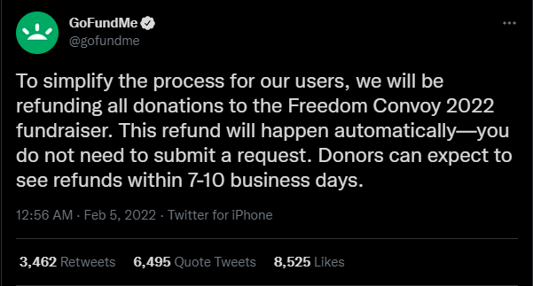

## A Real-World Example:
Before diving into how Whirlpool works, it is helpful to understand the implications of a fully transparant transaction ledger in the face of an ever increasingly adversarial world. This section will provide that background with a real-world example and an explaination of how bitcoin transaction are scrutinized in such a scenario using a ficticious character, Alice, to preserve the privacy of tose actually involved.

Take the recent Canadian Freedom Convoy for instance, here is a timeline of actual events with a hypothetical character, Alice, to preserve the privacy of anyone who actually participated.

- January 28, 2022: Truckers start arriving in Ottawa, ON
- February 1, 2022: [@HonkHonkHodl](https://twitter.com/HonkHonkHodl) receives first bitcoin donation via [@tallycoinapp](https://twitter.com/tallycoinapp). ([Link to tweet](https://twitter.com/HonkHonkHodl/status/1488625113406717952?s=20&t=3OffQxFJg4Y0qIy9vi_RAg)). Not many people were using Bitcoin to donate to the Freedom Convoy, many more donations were being made with traditional crowd funding platforms. This would soon change.

  
  

- February 5, 2022: [GoFundMe announced](https://twitter.com/gofundme/status/1489870510057877505?s=20&t=yIaTuK2kbAmCC1CL6FTaQw) that all donations to the Freedom Convoy would be refunded to the donors, banning any further involvement between the crowd funding platform and the Freedom Convoy. This was essentially an advertisement for unstoppable money like Bitcoin. Donations to the [@HonkHonkHodl](https://twitter.com/HonkHonkHodl) fundraising campaign through [@tallycoinapp](https://twitter.com/tallycoinapp) started to ramp up.

  
  

  
- February 7, 2022: Under an [order](https://www.cbc.ca/news/canada/toronto/freedom-convoy-2022-donations-frozen-give-send-go-1.6347345) issued by the Ontario Superior Court of Justice, another crowd funding platform, [@GiveSendGo](https://twitter.com/GiveSendGo) was compelled to freeze access to millions of dollars donated to the Freedom Convoy. [Official statement](https://givesendgo.com/site/pressrelease). This further escalated fundraising via Bitcoin through the [@HonkHonkHodl](https://twitter.com/HonkHonkHodl) fundraising campaign. 

- February 11, 2022: Ontario [declares](https://www.cbc.ca/news/canada/toronto/ford-announcement-ontario-protests-1.6347810) state of emergency. This declaration explicitly made it "illegal and punishable to block and impede the movement of goods, people and services along critical infrastructure". Further clarifying that "Fines for non-compliance will be severe, with a maximum penalty of $100,000 and up to a year imprisonment. We will also provide additional authority to consider taking away the personal and commercial licences of anyone who doesn't comply with these orders".

- February 14, 2022: Canadian Prime Minister, Justin Trudeau [invoked](https://www.cbc.ca/news/politics/trudeau-premiers-cabinet-1.6350734) the Emergencies Act. Among expanding the powers and reach of the Canadian government beyond that which may not be appropriate in normal times, the Emergencies Act had two specific and sweeping financial implications. First, this would capture crowd funding platforms and payment service providers under the Proceeds of Crime and Terrorist Financing Act. Second, crowd funding platforms and the payment service providers they use had to register with and report large and/or suspicious transactions to the Financial Transactions and Reports Analysis Centre of Canada (FINTRAC), the national financial intelligence agency.

- February 14, 2022: The same day the Canadian government invoked the Emergencies Act, [@HonkHonkHodl](https://twitter.com/HonkHonkHodl) closed out the fundraising campaign on [@tallycoinapp](https://twitter.com/tallycoinapp), having exceeded their original goal, reaching nearly 21 bitcoin in total donation. 

