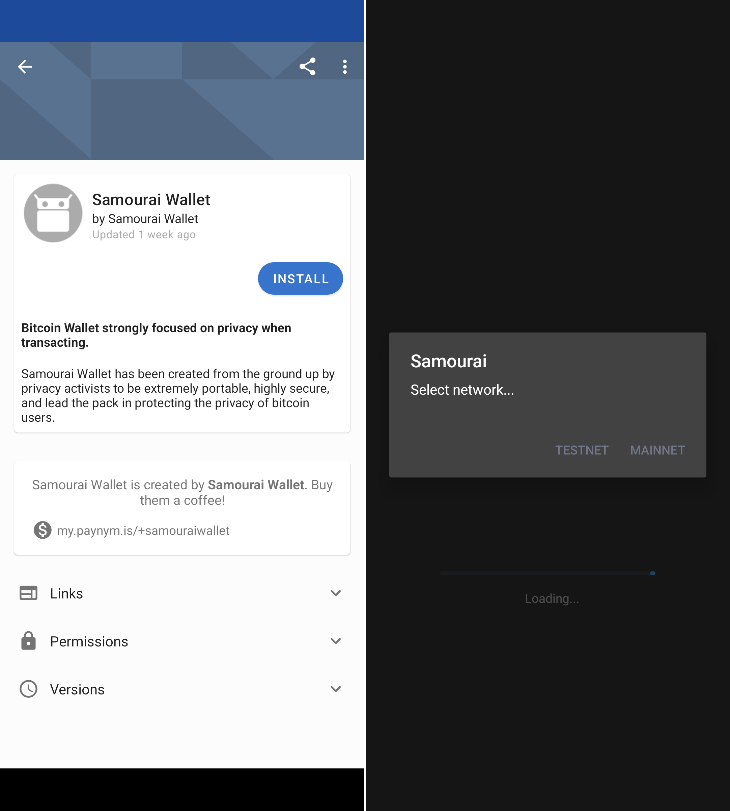
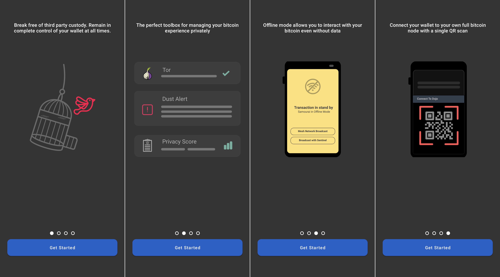
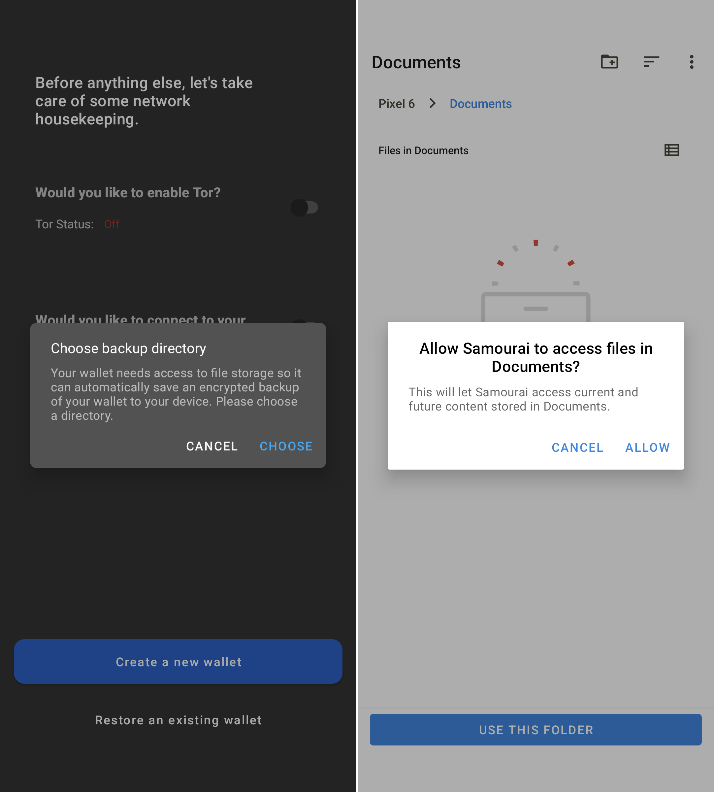
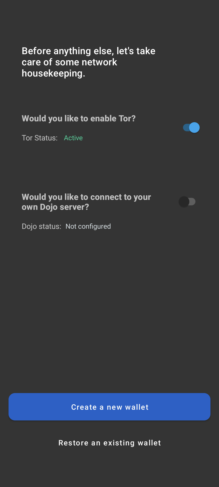
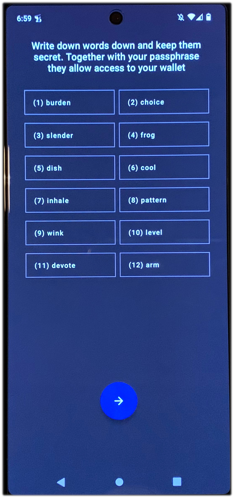

# Whirlpool On Mobile
This section will demonstrate how to install and setup a new [Samourai Wallet](https://samouraiwallet.com/) on Android. Samourai Wallet is a mobile first, privacy-focused Bitcoin wallet. Some of the privacy-enhancing tools built into Samourai Wallet are:

- Whirlpool, a zero-link CoinJoin implementation
- BIP47, a reusable payment code protocol
- PayNyms, unique identifiers that can be used to connect with peers for collaborative transactions
- Stonewall, a post-mix spending tool that breaks on-chain heuristics
- StonewallX2, a post-mix spending tool that looks identical to Stonewall on-chain but is actually made with two peers
- Stowaway, a post-mix spending tool that obfuscates the amount being spent
- Ricochet, a post-mix spending tool that add additional hops between the final payment destination
- Advanced coin control
- Seperate wallets for deposit, pre-mix, & post-mix bitcoin

The Whirlpool implementation can be used directly from the mobile Samourai Wallet application without any additional configuration. In this configuration, your instance of Samourai Wallet will communicate with the Samourai Wallet hosted Dojo. Using Samourai Wallet in connection with your own Dojo on the RoninDojo Tanto provides you with the most privacy conscience solution as you are not trusting someone else's node, you are using your own node. In the default configuration, Samourai Wallet will use your XPUB in order to display your wallet balances with information provided by the Samourai Wallet Dojo. 

Before you get started, it will help to have a [recovery sheet](https://samouraiwallet.com/recovery) or notebook to write your seed phrase and passphrase information. 

You can download the Samourai Wallet application from an [F-Droid](https://sovereignty.tools/) repo, thier [website](https://samouraiwallet.com/download), or [Google Play Store](https://play.google.com/store/apps/details?id=com.samourai.wallet&hl=en_US&gl=US).

Simply install the application and follow the on-screen system prompts. Once you launch the application, select `MAINNET`.

  
  

Next, you will be greeted with a helpful on-boarding presentation. 

  
  
  
  

Next, you will be asked to choose a directory to store your encrypted wallet backup file. Then allow system access. 

  
  

Next, you can toggle on the option to enable Tor. Leave the option to connect to your own Dojo toggled off to use the default settings which will communicate with the Samourai Wallet Dojo node instead of your own private Dojo node.

  

Alternatively, if you want to use your own Dojo node instead, toggle on the option to connect to your own Dojo. Then click on `Scan QR` and the application will ask you to grant camera permission.

  

This is where you want to select `Manage` in the lower left-hand corner of the `Dojo` window in your RoninDojo UI dashboard. Then scan the `Samourai Dojo` QR code from your mobile device. Once the details are received by the application, press the `Create a new wallet` button in Samourai Wallet. Or if you have a wallet to import then select the option to `Restore an existing wallet` instead.  

  
  

Next you will be asked to create a passphrase. Using a strong, high-entropy passphrase will help protect your bitcoin in the event that your 12-word seed phrase is ever compromised. Check the box that says you understand that no one can help you recover a lost or forgotten passphrase. Keep in mind too that any passphrase you enter will generate a completely different wallet, so make sure you are writing this down correctly and double checking your work. If you ever need to restore your wallet and you enter a passphrase that is off by even a single character then it will generate a completely different wallet. Then the app will ask you if you would like to download the same recovery sheet that is linked above. 

  
  

The next screen will present your 12-word seed phrase. Do not share these words with anyone for any reason. These 12-words are a human-readable representation of your Bitcoin private key. Anyone who gains access to these words and passphrase can take your bitcoin. Do not take a screenshot of these words. Do not take a picture of these words. Do not save them in a text file or other digital format. Make sure you write these down in order and then secure this seed phrase like it was cash, gold, or jewelry. Many people choose to stamp their wallet recovery information (seed phrase and passphrase) into metal that can withstand extreme environments such as fire and flooding. You can find further information on this topic [here](https://www.econoalchemist.com/post/backup).

  

  

Then you will be asked to confirm the passphrase you entered and then create a PIN. The PIN will be required to access the Samourai Wallet application, use a strong PIN that is not easy to guess or the same as your primary phone access PIN. 

  
  

Finally, you will be presented with your unique PayNym, you can claim it so that others can easily connect with you. Then you will be at the home screen, you can click on the blue `+` sign to see options for Whirlpool, Send, Receive, and PayNym. The receive option for example is where you can generate new Bitcoin addresses.   

  
  
  

