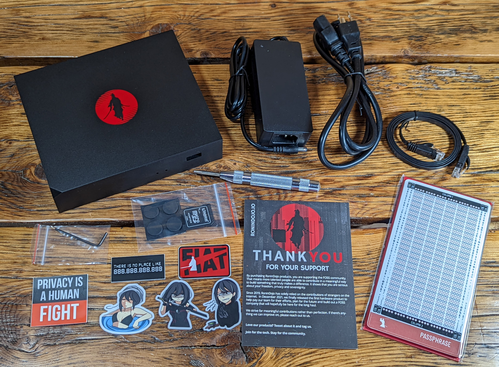

# Whirlpool On Desktop With RoninDojo
This section will demonstrate how to use Whirlpool on desktop with the Whirlpool GUI configured to run with your own Bitcoin full node, the Tanto by [RoninDojo](https://ronindojo.io/).

If you are not running your own Bitcoin node then you are trusting someone else's. RoninDojo is a FOSS developer team focused exclusively on building the most stable and tailored full node for [Samourai Wallet](https://samouraiwallet.com/) support. With Samourai Wallet and RoninDojo combined, users are empowered with a mobile-first Bitcoin wallet that features privacy-enhancing tools like a Whirlpool CoinJoin implementation and post-mix collaborative spending tools; all powered by the user's own self-hosted Bitcoin full node communicating with the mobile client over Tor. This guide demonstrates setting up a new plug & play full Bitcoin node from [RoninDojo](https://ronindojo.io/) called the Tanto.

  
 

 
The Tanto comes pre assembled and pre-loaded with the RoninDojo software, there is no need to build a material list and order several pieces of hardware from multiple vendors. The Tanto features an aluminium case and bottom plate, painted black with a sleek RoninDojo logo in red. Inside the case, the Tanto is powered by a RockPro64 board, an interface card, and an M.2 NVMe 1TB SSD. The Tanto also includes a 32GB microSD card pre-loaded with the RoninDojo software image and power supply. Everything you need to get started is included. 

Additionally, the Tanto includes a the RoninSteel stainless steel seed phrase back up plate. Check out [this guide](https://bitcoinmagazine.com/guides/how-to-bitcoin-seed-backup-roninsteel) to see a demonstration of the RoninSteel.

All together the Tanto includes:

- Aluminum case & bottom plate
- Ronin X4-90 adaptor
- LED stripe with GPIO connectors
- Thermo pad, rubber feet, screws, & hex wrench
- RockPro board
- RockPro64 PCIe X4 to M.2/NGFF NVMe SSD interface card
- Power supply
- M.2 SSD M-key, 1TB
- 32GB microSD card
- RoninSteel backup kit
- Spring loaded punch
- Ethernet cable
- Sticker pack
- "Thank you" card

  
  

## Connecting
Connecting the Tanto is very simple:

- Plug one end of an Ethernet cable into the back of the Tanto.
- Plug the other end of the Ethernet cable into your router or switch.
- Plug in the power adaptor. 

 

Next, just plug one end of the power cable for the included power supply into your outlet and the other end into the transformer. 

 

The Tanto will automatically power on and start the initial configuration process. Ensure that the power is not interrupted during the automatic initial configuration process. This process takes roughly 10 minutes and you will notice the red light illuminate underneath the Tanto once this process is finished. Then, you will be ready to login to the Tanto through the web interface. 

## Configuring
Configuring the Tanto is also very easy, it only takes a few minutes and the basic steps are to set your password then login. 

Visit the official [RoninDojo Wiki](https://wiki.ronindojo.io/en/setup/tanto-setup) for detailed instructions and more. 

  

Using a PC connected to the same local network as your Tanto, open your favorite web browser and type `https://ronindojo.local` into the URL bar. This should bring up the RoninDojo welcome page.

If that did not work, then you can achieve this same process by using the local IP address of your Tanto instead. This IP address can be found by logging into your router and checking the list of devices under the DHCP leases section. Your router should have the local IP address needed to login, along with the password on a label somewhere on the device. If not, the directions are usually pretty easy to find with an online search for your manufacturer's router. Typically, you can just type `192.168.0.1` or `192.168.1.1` or `10.0.0.1` into your web browser and that will bring you to your router login page. From there the username/password can vary depending on manufacturer but they are usually something like `admin/admin` or `admin/1234` or `admin/password`. Alternatively, programs like [AngryIP](https://angryip.org/) may be used.

In this example, the local IP address `192.168.69.17` is the one used to type into the URL bar. 

  

Once you are at the RoninDojo welcome page, select `Let's start`.

You will be presented with your Root credentials, these are like the master username and password for the Tanto's backend. Save these details in a secure place like a password manager and do not share these with anyone for any reason. You cannot change these, they are pre-selected for you. Ensure that you select the box that says `I have backed up Root user credentials`, then click on `Continue`.

  

Next, you will set your user credentials, these are the ones you will use to access the Tanto through the webinterface. The username is pre-selected for you, `ronindojo`. You can create any password you would like to use, just ensure it is at least 8 characters. Repeat this password and make sure you secure these credentials in a safe place like a password manager and do not share them with anyone for any reason. Then click on `Finish`.

  

Next, you will see several services such as Bitcoin Core, Node.js, Indexer, BTC-RPC Explorer, Database, Nginx, Tor, & Samourai Whirlpool start. This takes a few minutes. 

  

Once there is a green check mark next to each service, you can click on the `Take me to the Dashboard` button. 

  

Once you are at your dashboard, you can see the progress of the Bitcoin Initial Blockchain Download (IBD) and the vitals of your Tanto. The IBD will take about two days to complete, the Tanto is connecting to other Bitcoin nodes and downloading the entire Bitcoin blockchain all the back to the first block from January 2009. Once the IBD completes, you will have your own full copy of the blockchain and you will use your own copy to verify your transactions against.  

  

Some other vitals you can monitor are uptime, version, temperature, CPU load, and memory usage. Let this process run for a couple of days. Tanto will log you out automatically after some idle time but the processes continue to run in the background. 

The IBD took a total of 2 days, 21 hours, 49 minutes in this demonstration. 

  

Now that the entire Bitcoin blockchain has been downloaded, it needs to be indexed so that it is searchable. The indexing process begins automatically once the IBD is finished, this process can take an additional day. You may notice that the Indexer status in the lower right-hand corner remains on 0%, don't panic! Simply navigate to the `Logs` option on the left-hand side menu and then the `Indexer` tab. You should see something like this screenshot below where the blocks are getting indexed in chunks of 2,000. Just let this process run to completion, again this can take another 24 hours. 

  

Once the Indexer has caught up to the latest block height, you should see both Indexer and Dojo reporting 100% synchronized.

  

You can click on `Manage` in the lower left-hand corner of the `Dojo` window and this will bring up the QR code that you can use to connect your Samourai Wallet. Setting up Samourai Wallet will be covered in the next section. Make sure to toggle `Display values` to make the QR codes legible. The other QR code is for connecting your own BTC-RPC explorer. The Explorer provides a way to use your own Dojo to feed data to a full fledged Bitcoin blockchain explorer over Tor. Copy the .onion URL & password for the Explorer, paste into Tor Browser, use `ronindojo` for the username, and bookmark page. 

  

You can even log into your RoninDojoUI from your mobile phone with the Tor Browser. From the dashboard, click on `Manage` in the lower left-hand corner of the `RoninDojo` window. This will bring up a QR code that you can scan to follow the .onion link to your RoninDojo UI. Then enter your RoninDojo UI password and bookmark this page. 

  

Once you are logged into your RoninDojo UI on mobile, then you can just copy/paste the .onion URL and password for the Explorer into your Tor browser as well, then using `ronindojo` as a username again, you can book mark this page as well and now you have a mobile block explorer that uses your own Dojo as a backend and communicates with it via Tor. 

  
  

## The Whirlpool GUI
This section will demonstrate how to connect the Whirlpool desktop client to your Tanto full node and your Samourai Wallet. With this configuration, you will be able to have your UTXOs mixing non-stop in the backround from your desktop client and powered by your own full node. When you mix from mobile only, the mixing stops as soon as you shut down your mobile Whirlpool client in Samourai Wallet. 

First, you will need to download the Whirlpool client appropriate for your operating system. The different options along with accompanying developer signatures can be found [here](https://samouraiwallet.com/download) and detailed installation instructions can be found [here](https://docs.samourai.io/whirlpool/desktop). Be aware you will likely need to install Open JDK as well which is covered in the installation instructions. 

 

Once you have your Whilpool client installed and your Samourai Wallet connected to your RoninDojo Tanto, you can make an SSH connection to the RoninDojo and start the Whirlpool service. The Whirlpool .onion URL you need is not available through the RoninDojo UI dashboard. The SSH connection can be made with the same username password you used for the RoninDojo UI.

Once connected, navigate to `Samourai Toolkit` > `Whirlpool`:

 
 

Then select `start`, a script will run briefly and then you can hit any key to return to the main menu when prompted. 

 
 

With the Whirlpool service started, and back at the main menu, now navigate to `Credentials` > `Whirlpool`

 
 

This is where you can retrieve the .onion URL you need to use in the Whirlpool client Graphical User Interface (GUI) to get it configured. Highlight this URL and use `ctrl+shift+c` to copy it to your clipboard. 

 

Now open the Whirlpool client application you installed earlier. Select the `Advanced: remote CLI` option and where it says `https://my-cli-host:8899` paste the .onion URL from your RoninDojo terminal. Depending on whether or not your are running a Tor daemon or just the Tor browser, you may need to select either `9050` or `9150` for appending the Tor proxy. Leave the API key blank, this will automatically be handled once initialized. Then click on `Connect`. 
 

 

 

Give the GUI some time, Tor connections can take a little while. You may need to try this a couple times before the connection is made. But once the connection is made, you will be presented with a screen asking you to input the Whirlpool pairing payload from your Samourai Wallet. In Samourai Wallet, click on the 3-dot menu in the upper right-hand corner and select `Settings` > `Transactions` > `Pair to Whirlpool GUI` at the bottom. This will display a QR code that contains your Whirlpool payload. Simply click on the QR code option in the desktop GUI and this should launch your webcam then hold up the QR code on your mobile so the camera can scan it. 

 

 

Once received, then click on `Initialize GUI`.

 

 

Next, enter the passphrase for your Samourai Wallet and click on `Sign in`.

 

 

Once signed in, you should be able to see your balances, mixing activity, and then you can set targets for how many mixes you wish to achieve. You can even generate deposit addresses from the Whirlpool GUI.

 

 
