# Method 1: Whirlpool On Mobile
This section will demonstrate how to install and setup a new [Samourai Wallet](https://samouraiwallet.com/) on Android. Samourai Wallet is a mobile first, privacy-focused Bitcoin wallet. Additional, connecting Samourai Wallet to the Desktop Whirlpool GUI will be covered. Some of the privacy-enhancing tools built into Samourai Wallet are:

- Whirlpool, a zero-link CoinJoin implementation
- BIP47, a reusable payment code protocol
- PayNyms, unique identifiers that can be used to connect with peers for collaborative transactions
- Stonewall, a post-mix spending tool that breaks on-chain heuristics
- StonewallX2, a post-mix spending tool that looks identical to Stonewall on-chain but is actually made with two peers
- Stowaway, a post-mix spending tool that obfuscates the amount being spent
- Ricochet, a post-mix spending tool that adds additional hops between the final payment destination
- Advanced coin control
- Separate wallets for deposit, pre-mix, & post-mix bitcoin

The Whirlpool implementation can be used directly from the mobile Samourai Wallet application without any additional configuration. However, if you are not using your own node then you are trusting someone else's. Using Samourai Wallet in connection with your own Dojo on the RoninDojo Tanto provides you with the most privacy conscience solution as you are not trusting someone else's node, you are using your own node. Every Bitcoin wallet, be it mobile or desktop, needs to gather information about wallet balances and transaction history from a Bitcoin node; it is best practice to use your own node but it is not a requirement as many wallet developers provide publicly accessible nodes. This section will demonstrate how to use Samourai Wallet without your own node as this is the simplest and fastest way to start. The other two methods covered in this guide build on these concepts and introduce the more advanced configuration of using your own node.  

## Step 1: Preparation
Before you get started, it will help to have a [recovery sheet](https://samouraiwallet.com/recovery) or notebook to write your seed phrase and passphrase information. 

## Step 2: Download
You can download the Samourai Wallet application from an [F-Droid](https://sovereignty.tools/) repo, thier [website](https://samouraiwallet.com/download), or [Google Play Store](https://play.google.com/store/apps/details?id=com.samourai.wallet&hl=en_US&gl=US).

## Step 3: Initialize
Simply install the application and follow the on-screen system prompts. Once you launch the application, select `MAINNET`.

  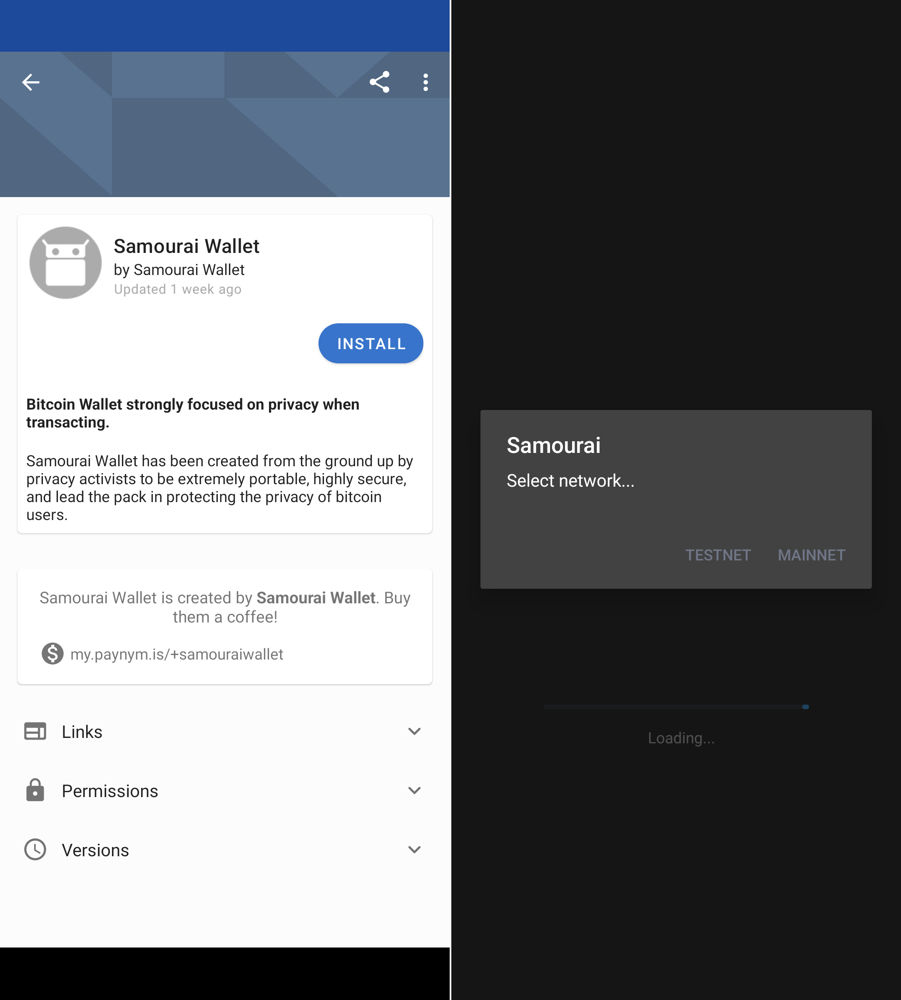

Next, you will be greeted with a helpful on-boarding presentation. 

  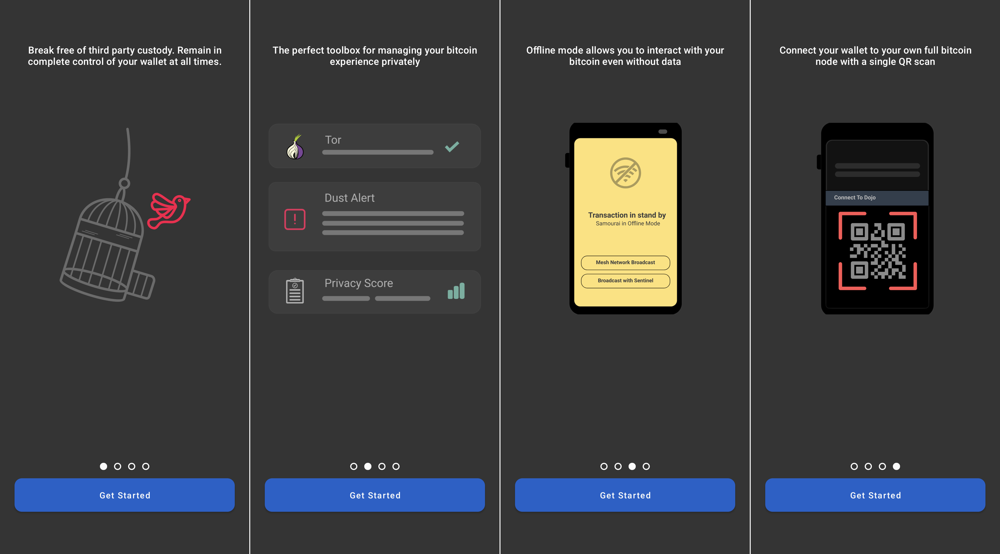

Next, you will be asked to choose a directory to store your encrypted wallet backup file. Then allow system access. 

  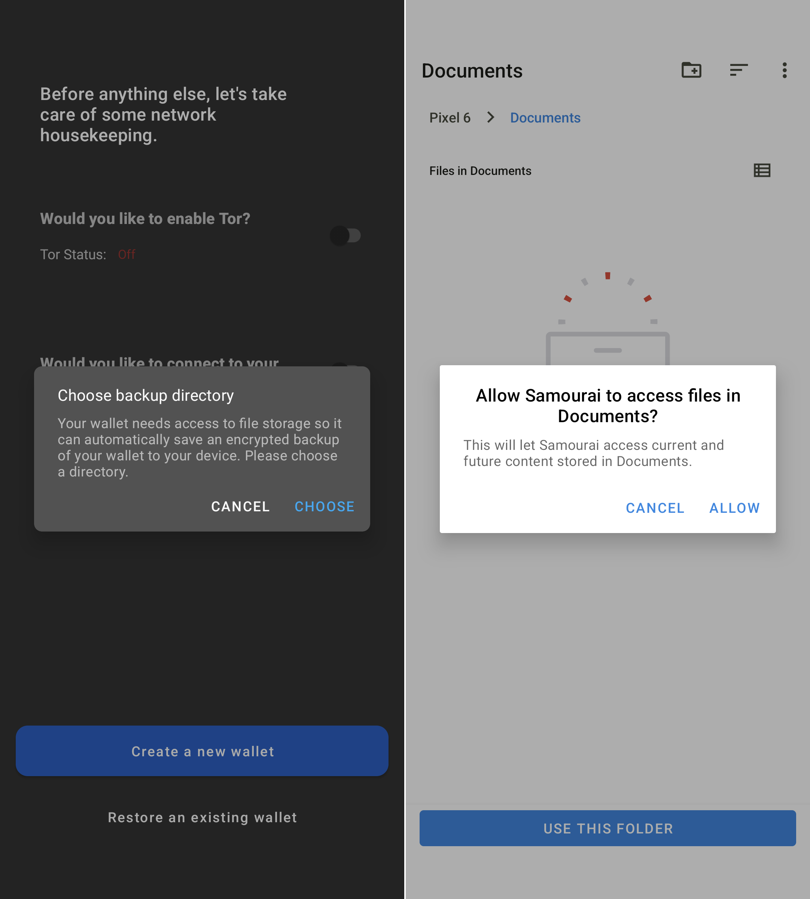

Next, you can toggle on the option to enable Tor. Leave the option to connect to your own Dojo toggled off to use the default settings which will communicate with the Samourai Wallet Dojo node instead of your own private Dojo node. Then press the `Create a new wallet` button in Samourai Wallet. Or if you have a wallet to import then select the option to `Restore an existing wallet` instead.  

  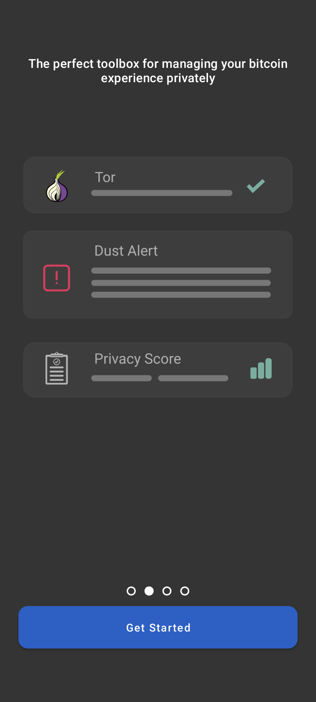

Next you will be asked to create a passphrase. Using a strong, high-entropy passphrase will help protect your bitcoin in the event that your 12-word seed phrase is ever compromised. Check the box that says you understand that no one can help you recover a lost or forgotten passphrase. Keep in mind too that any passphrase you enter will generate a completely different wallet, so make sure you are writing this down correctly and double checking your work. If you ever need to restore your wallet and you enter a passphrase that is off by even a single character then it will generate a completely different wallet. After entering your passphrase, the app will ask you if you would like to download the [recovery sheet](https://samouraiwallet.com/recovery). 

  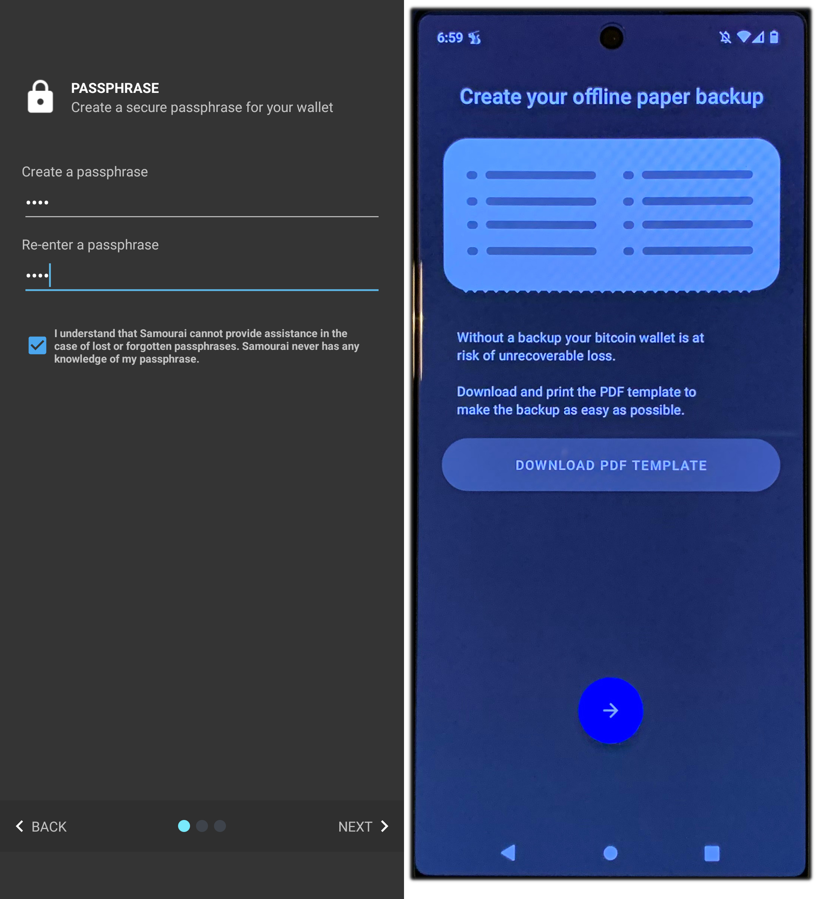

The next screen will present your 12-word seed phrase. Do not share these words with anyone for any reason. These 12-words are a human-readable representation of your Bitcoin private key. Anyone who gains access to these words and passphrase can take your bitcoin. Do not take a screenshot of these words. Do not take a picture of these words. Do not save them in a text file or other digital format. Make sure you write these down in order and then secure this seed phrase like it was cash, gold, or jewelry. Many people choose to stamp their wallet recovery information (seed phrase and passphrase) into metal that can withstand extreme environments such as fire and flooding. You can find further information on this topic [here](https://www.econoalchemist.com/post/backup).

  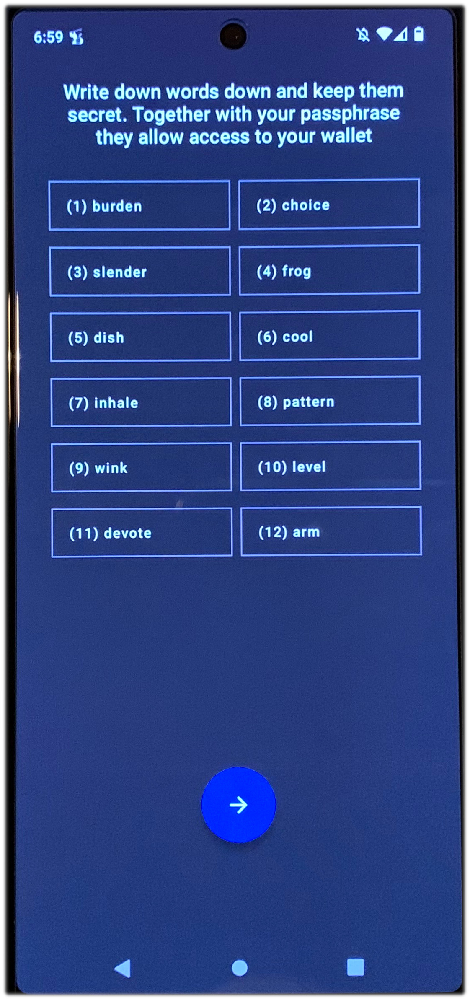

  

Then you will be asked to confirm the passphrase you entered and then create a PIN. The PIN will be required to access the Samourai Wallet application, use a strong PIN that is not easy to guess or the same as your primary phone access PIN. 

  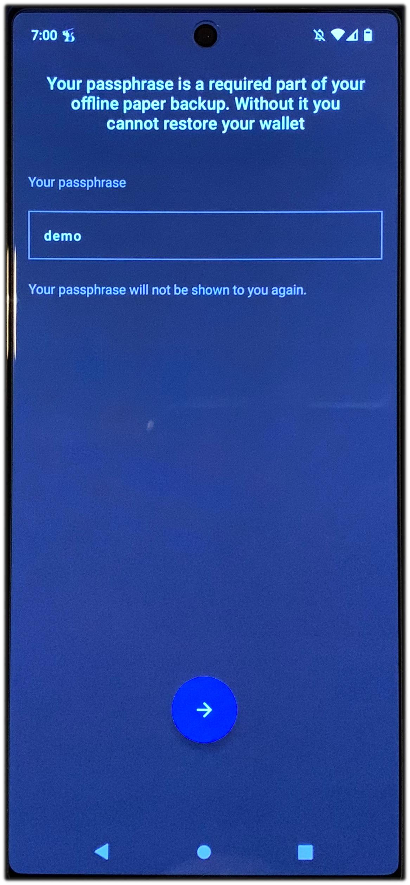
  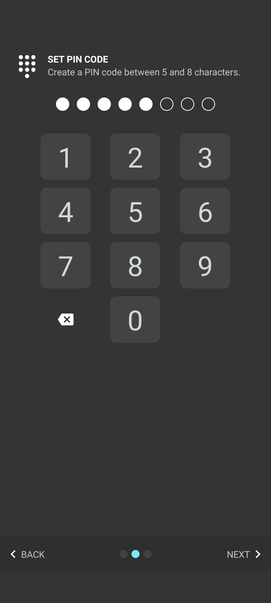

Finally, you will be presented with your unique PayNym, you can claim it so that others can easily connect with you. Then you will be at the home screen, you can click on the blue `+` sign to see options for Whirlpool, Send, Receive, and PayNym. The receive option for example is where you can generate new Bitcoin addresses.   

  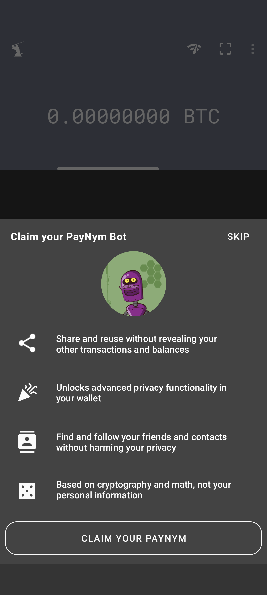
  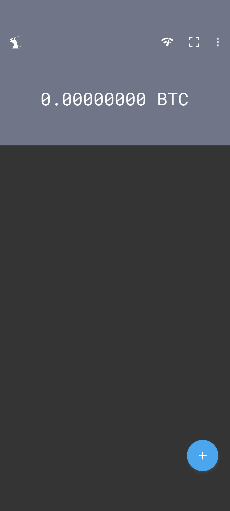
  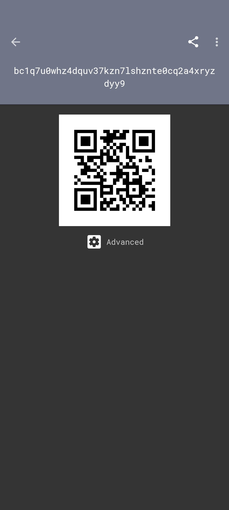

## Step 4: Whirlpool on Mobile
Now you have a mobile Bitcoin wallet with built in privacy tools that communicates over Tor. Congratulations, this is a great step along the path to sovereignty. Go out and earn some bitcoin in exchange for goods or services, buy some from an ATM, or earn some mining rewards. 

Once you have received bitcoin that you would like to mix, simply follow these steps from your mobile Samourai Wallet:

- Select the blue `+` sign and then the `Whirlpool` button. 
- This will launch the mobile Whirlpool client, again select the `Whirlpool` button. 

 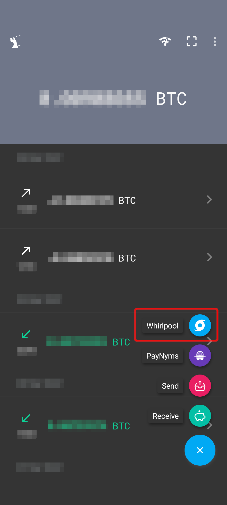
 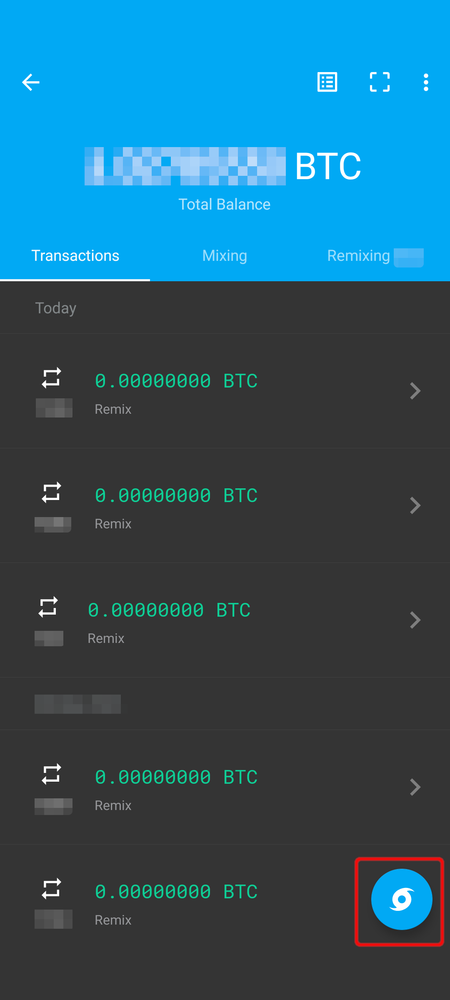

 

- Select the option to `Mix UTXOs`.  
- A list of the available UTXOs from your deposit wallet will be displayed. Select the UTXOs you would like to mix and then click on `NEXT`. Keep in mind, if any of these UTXOs have history that you do not want connected on-chain, consider selecting them independent of each other. 

 
 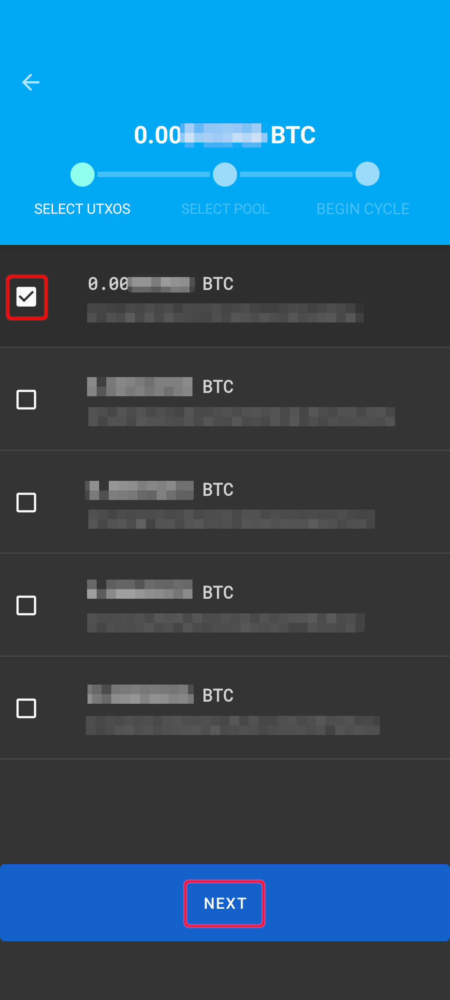

 

- Select the cycle priority (miners fee), select the pool size appropriate for the amount you are mixing, and select `REVIEW CYCLE DETAILS`. 
- You will be presented with the details of the TX0 you are about to make. Select `BEGIN CYCLE` once ready and the transaction will be built and then broadcast to the Bitcoin network. 

 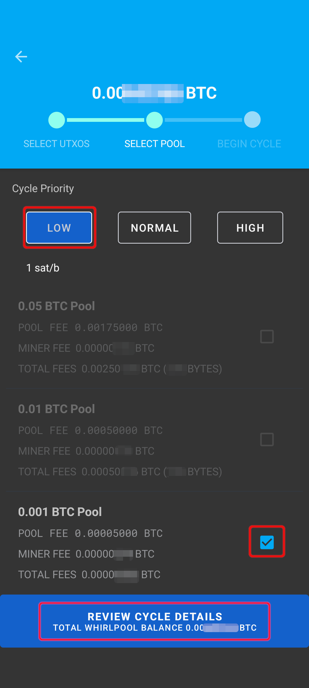
 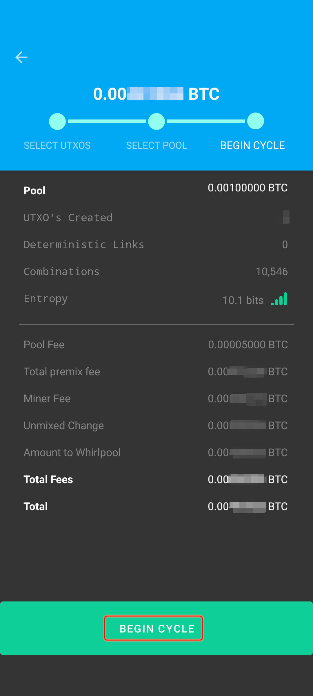

 

Now your resulting UTXOs from the TX0 will be registered as available inputs to new mixes. Once mixed, your UTXOs will be in your post-mix wallet. From there, anytime you open the Whirlpool client in your mobile Samourai Wallet application, those UTXOs will be registered as available inputs to mixes looking for free-riders. The mixing stops once you close the mobile Whirlpool client. 

## Step 5: Whirlpool with Standalone GUI
Going a step further, there is a way to achieve 24/7 mixing, even when you close the application on your mobile. You can install the Whirlpool GUI on your desktop, connect it to your mobile wallet and the desktop GUI will keep your UTXOs mixing. 

First, you will need to download the Whirlpool client appropriate for your operating system. The different options along with accompanying developer signatures can be found [here](https://samouraiwallet.com/download) and detailed installation instructions can be found [here](https://docs.samourai.io/whirlpool/desktop). Be aware you will likely need to install Open JDK as well which is covered in the installation instructions. 

 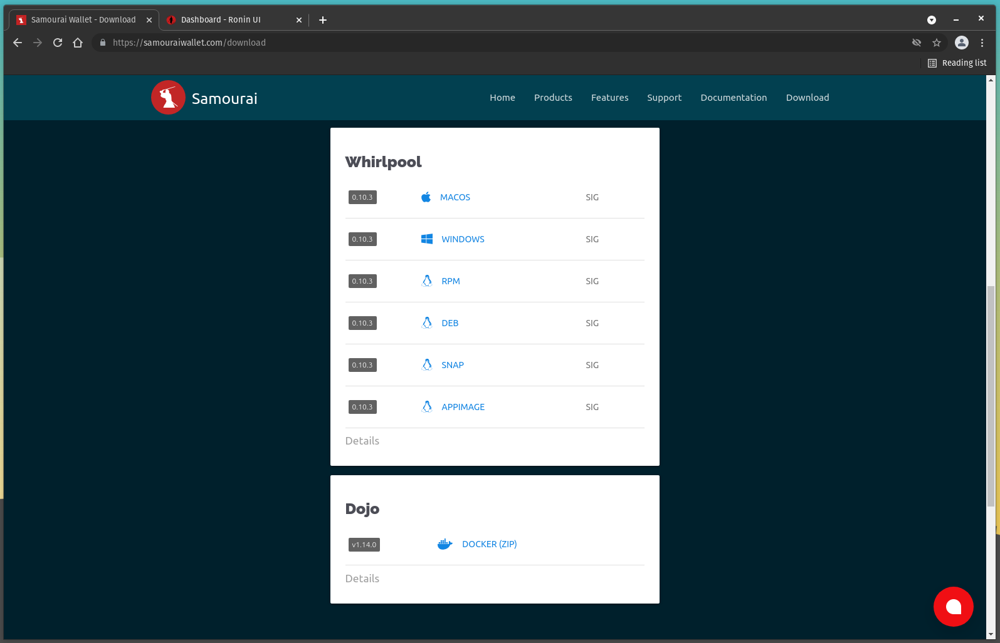

After installing the Whirlpool client application, launch it and then select the `Standalone: Standalone GUI` option. Then click on <kbd>Continue</kbd>.

 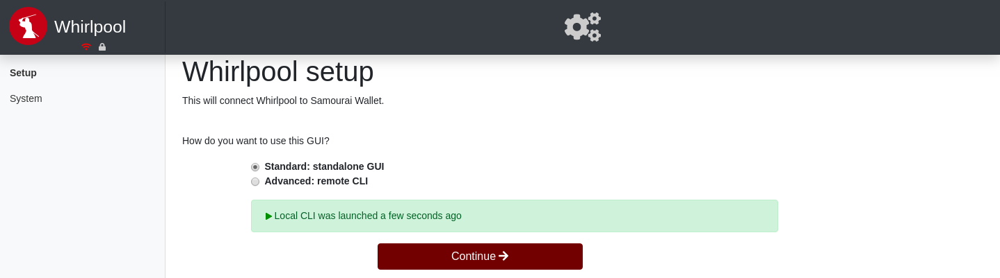

Give the GUI some time, Tor connections can take a little while. You may need to try this a couple times before the connection is made. But once the connection is made, you will be presented with a screen asking you to input the Whirlpool pairing payload from your Samourai Wallet. In Samourai Wallet, click on the 3-dot menu in the upper right-hand corner and select `Settings` > `Transactions` > `Pair to Whirlpool GUI` at the bottom. This will display a QR code that contains your Whirlpool payload. Simply click on the QR code option in the desktop GUI and this should launch your webcam then hold up the QR code on your mobile so the camera can scan it. 

 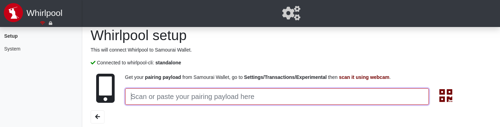

 

Once received, then click on <kbd>Initialize GUI</kbd>.

 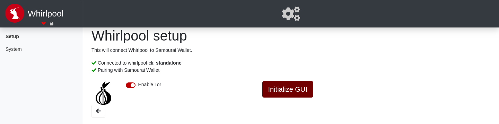

 

Next, enter the passphrase for your Samourai Wallet and click on <kbd>Sign in</kbd>.

 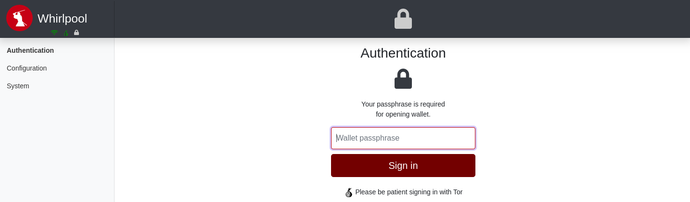

 

Once signed in, you should be able to see your balances, mixing activity, and then you can set targets for how many mixes you wish to achieve. You can even generate deposit addresses from the Whirlpool GUI.

 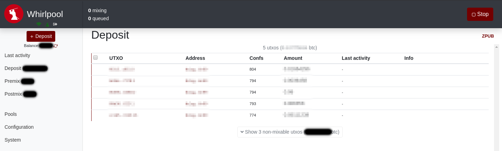

 

Now when you initiate mixes from your mobile Samourai Wallet app, you can close the app afterwards and your UTXOs will continue to be registered as available inputs to mixes as free-riders so long as your desktop client stays running. This configuration is using the default Samourai Wallet node as a backend. For network privacy, the communication happens over Tor. This can also be configured to use your own node instead which will be covered in the next section. 
