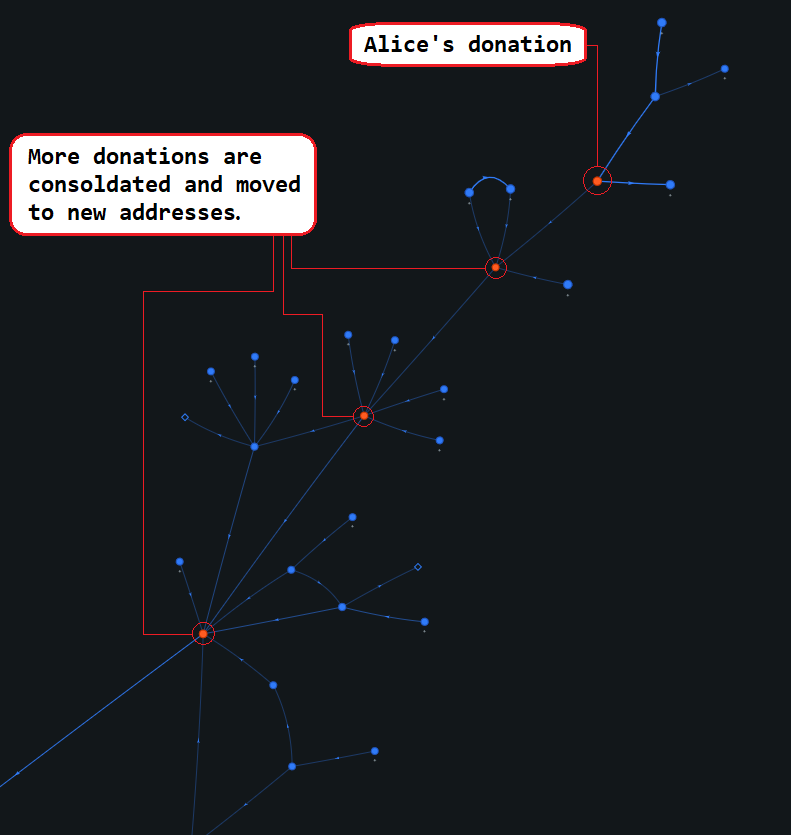
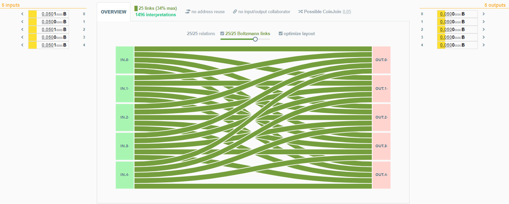

# A Real-World Example:
Now that you have seen how to use Whirlpool, it may be helpful to understand the implications of a fully transparent transaction ledger in the face of an ever increasing adversarial environment. This section will provide that background with a real-world example and an explanation of how bitcoin transactions are scrutinized in such a scenario.

## Timeline
Here is a time line of the recent Canadian Freedom Convoy with notable events as they relate to Bitcoin.

- January 28, 2022: Truckers start arriving in Ottawa, ON
- February 1, 2022: [@HonkHonkHodl](https://twitter.com/HonkHonkHodl) receives first bitcoin donation via [@tallycoinapp](https://twitter.com/tallycoinapp). ([Link to tweet](https://twitter.com/HonkHonkHodl/status/1488625113406717952?s=20&t=3OffQxFJg4Y0qIy9vi_RAg)). Not many people were using Bitcoin to donate to the Freedom Convoy, many more donations were being made with traditional crowd funding platforms. This would soon change.

 

- February 5, 2022: [GoFundMe announced](https://twitter.com/gofundme/status/1489870510057877505?s=20&t=yIaTuK2kbAmCC1CL6FTaQw) that all donations to the Freedom Convoy would be refunded to the donors, banning any further involvement between the crowd funding platform and the Freedom Convoy. This was essentially an advertisement for unstoppable money like Bitcoin. Donations to the [@HonkHonkHodl](https://twitter.com/HonkHonkHodl) fundraising campaign through [@tallycoinapp](https://twitter.com/tallycoinapp) started to ramp up.

 

  
- February 7, 2022: Under an [order](https://www.cbc.ca/news/canada/toronto/freedom-convoy-2022-donations-frozen-give-send-go-1.6347345) issued by the Ontario Superior Court of Justice, another crowd funding platform, [@GiveSendGo](https://twitter.com/GiveSendGo) was compelled to freeze access to millions of dollars donated to the Freedom Convoy. [Official statement](https://givesendgo.com/site/pressrelease). This further escalated fundraising via Bitcoin through the [@HonkHonkHodl](https://twitter.com/HonkHonkHodl) fundraising campaign. 

- February 11, 2022: Ontario [declares](https://www.cbc.ca/news/canada/toronto/ford-announcement-ontario-protests-1.6347810) state of emergency. This declaration explicitly made it *"illegal and punishable to block and impede the movement of goods, people and services along critical infrastructure". Further clarifying that "Fines for non-compliance will be severe, with a maximum penalty of $100,000 and up to a year imprisonment. We will also provide additional authority to consider taking away the personal and commercial licenses of anyone who doesn't comply with these orders"*.

- February 14, 2022: Canadian Prime Minister, Justin Trudeau [invoked](https://www.cbc.ca/news/politics/trudeau-premiers-cabinet-1.6350734) the Emergencies Act. Among expanding the powers and reach of the Canadian government beyond that which may not be appropriate in normal times, the Emergencies Act had two specific and sweeping financial implications. First, this would capture crowd funding platforms and payment service providers under the Proceeds of Crime and Terrorist Financing Act. Second, crowd funding platforms and the payment service providers they use had to register with and report large and/or suspicious transactions to the Financial Transactions and Reports Analysis Centre of Canada (FINTRAC), the national financial intelligence agency. Financial accounts would be frozen without court order for individuals identified as being associated with the Freedom Convoy. 

- February 14, 2022: The same day the Canadian government invoked the Emergencies Act, [@HonkHonkHodl](https://twitter.com/HonkHonkHodl) closed out the fundraising campaign on [@tallycoinapp](https://twitter.com/tallycoinapp), having exceeded their original goal, reaching nearly 21 bitcoin in total donations. 

 

- February 15, 2022: The Ontario Superior Court of Justice enacted the [Mareva Injunction](https://ottawaconvoyclassaction.ca/order-mareva.pdf), a $306,000,000 class action law suit. This injunction named 17 individuals, 2 organizations, and 62 anonymous entities as defendants further stipulating that *"Any other person who knows of this order and does anything which helps or permits the Defendant to breach the terms of this Order may also be held to be in contempt of court and may be fined or imprisoned"*. Essentially, anyone who did so much as [serve coffee](https://twitter.com/Ranting4Canada/status/1495471835420450816?s=20&t=h49vUtxlCn-6s__PI9vfXg) to a Freedom Convoy suspect would face fines and imprisonment. This injunction goes as far as to include several Bitcoin addresses, so if one of these ends up in connection with your identity then you would be in violation of this injunction.   

- February 16, 2022: [News broke](https://twitter.com/nobsbitcoin/status/1493978391099457536?s=20&t=3OffQxFJg4Y0qIy9vi_RAg) that the Royal Canadian Mounted Police (RCMP) published a blacklist of cryptocurrency addresses related to the Freedom Convoy donations. Essentially, this meant that any funds connected to any of these addresses hitting a bitcoin-to-fiat off ramp would trigger seizure and immediate reporting to authorities based on the emergency measures put in place just days prior. 

## Summary
Essentially what transpired in the timeline above is that in less than two weeks the Canadian government managed to turn a swath of the population into criminals and then there was nothing stopping the government from disregarding the rights of this massive group of people. This is what I refer to as the "pendulum swinging". One day you are leading a perfectly normal and legal life, the next you are a criminal and face severe consequences for doing what was once inconsequential. If you value being able to communicate with your friends and family, the freedom of movement, and being able to access financial services or spend your money on the things you choose then it would benefit you to start taking small incremental steps to guard these freedoms. There are many resources available to those who want to learn more about the tools available to you in this fight. 

- [Bitcoiner.Guide](https://bitcoiner.guide/)
- [Diverter.HostYourOwn.Tools](https://diverter.hostyourown.tools/)
- [K3tan.com](https://www.k3tan.com/)
- [x21.tools](https://x21.tools/)

## Follow the money
This section will follow the flow of a donation on the Bitcoin blockchain to the Freedom Convoy Bitcoin address. Then beyond to the disbursed payments to the truckers. At points along this path, it will be pointed out where Whirlpool could have been used and how it would have helped prevent the targeting of specific individuals who allowed their identity to be linked with their on-chain activity. The Transaction ID's (txid), Bitcoin Addresses, and dates have been obfuscated but these are actual transactions surrounding the [@HonkHonkHodl](https://twitter.com/HonkHonkHodl) donations. 

This demonstration follows the transactions of an entity named Alice. Alice has about 28 bitcoin in her wallet, in a single Unspent Transaction Output (UTXO). One day, Alice decides to use the UTXO to make a 0.3 BTC deposit to a CoinBase account. On-chain heuristics would make the reasonable assumption that the CoinBase account is owned by Alice. In that transaction, the 28 BTC is used as the only input and there are two outputs. The first output is the 0.3 BTC to her assumed CoinBase account. The second output is her remaining 28 BTC. 

As time goes on, Alice makes three more transactions with this 28 BTC. Each time providing the 28 BTC as an input with a small amount being spent and the remainder being returned to her as change. This kind of spending pattern on-chain is known as a "peel-chain", Whirlpool helps break this cycle by breaking the deterministic links. 

On the fourth transaction, Alice made a donation to the Freedom Convoy. 

Each time Alice made a transaction, the 28 BTC UTXO was used as an input and a little bit was spent, returning the bulk of that 28 BTC to Alice as the change. Then that change was spent as an input to the next transaction with a little bit peeled off as the spend and the remainder returned to Alice again. Because of this peel chain pattern of simple transactions, the 0.3 BTC spend to CoinBase in the first transaction makes the assumption that CoinBase is aware of Alice's true identity and aware that she owns the 28 BTC that she continued spending down stream. CoinBase can also see every transaction related to that bitcoin. 

By the time Alice made a donation to the Freedom Convoy, she used what was left of that original 28 BTC. In the donation transaction, Alice provided a 24.07 BTC input. The transaction had two outputs, a 0.25 BTC donation to the known Freedom Convoy Bitcoin donation address hosted on the Tally Coin website. The other output was 23.82 BTC being returned to Alice as change. 

Assuming CoinBase knows Alice's true identity and her on-chain activity is directly linked to her CoinBase account, her true identity can be revealed as a donor to the Freedom Convoy if authorities investigate the matter. After Alice made her donation, more bitcoin was consolidated and moved down stream by the Freedom Convoy Bitcoin donation organizer(s). 

The entity in control of the Freedom Convoy donations makes several transactions that consolidate bitcoin and move the new balances to new addresses. Throughout the entirety of the Tally Coin fundraising campaign, the same Bitcoin donation address was used. 

 

 

In order to disburse donations to Freedom Convoy truckers, the entity in control of the bitcoin established 100 different wallets for the truckers. They made 3 deposits to each wallet. Unfortunately, they used the same address in each wallet for each of the three deposits instead of using a new address each time. Address reuse is bad for privacy because then all transactions involving that one address are known to be controlled by the entity that possesses the signing key for that address. The Whirlpool coordinator enforces strict rules that do not allow address reuse in CoinJoin transactions. 

This graph shows many donations being made to the known Tally Coin Bitcoin donation address. Then those donations are consolidated and moved to new addresses in three transactions leading up to the transaction where the bitcoin was disbursed to 100 wallets in what seems to be a test transaction. Each deposit was only 4,800 sats. 

A few blocks later another deposit was made to the 100 wallets for the truckers. This transaction was funded by a 14.67 BTC consolidation of the Freedom Convoy donations. There were 100 equal sized outputs of 0.004 BTC, each going to the same address as the 4,800 sat deposit in each of the 100 wallets. There was a 14.27 BTC output from this transaction as well. 

The 14.27 BTC output was used a few blocks later as an input to the third trucker wallet deposit. This transaction deposited 100 equal sized outputs of 0.14 BTC, each going to the same address as the 4,800 sat deposit and the 0.004 BTC deposit in each of the 100 wallets. 

The majority of the trucker deposits have remained unspent. The ones that have been spent have gone to KYC exchanges like CoinBase, Ctypto.com, & Kraken. 

Unfortunately, the Canadian government has blacklisted several if not all of these addresses, ready to impose strict penalties on anyone who is associated with these donations. For the trucker who sent their deposit to CoinBase, this means that they will be identified as a guilty party. The exchanges will seize and report any activity on their platforms related to any of these donations. For Alice, it is now possible to directly tie her identity to some of the donated bitcoin because of her deposit to her CoinBase account several transactions prior to the donation. This means that Alice will be reported and possibly face penalties in relation to supporting the Freedom Convoy. 

## How Whirlpool fixes this
To understand how the Whirlpool CoinJoin implementation can be used as a tool for breaking on-chain heuristics and gaining forward looking anonymity, it is important to first understand the issues with simple Bitcoin transactions that have one input and two outputs. In the real-world example above you can see how an individual making these kinds of simple transactions can leave traces on-chain that irrevocably connect them to activity which authorities are actively trying to punish. Here is a visual example to help elaborate the point, this is Alice's transaction that spent one output to her assumed CoinBase account. 

You can see that there is only one way to interpret this transaction, Alice owned the entire 28.49 BTC input, sent 0.3 BTC to CoinBase, and received 28.18 BTC back in change. Then further heuristics can be made to extrapolate information that is not embedded in the transaction, such as it being more likely than not that Alice owns the CoinBase account that the 0.3 BTC were deposited to. Going further then, it is possible to reasonably attach Alice's real identity with the 28.18 BTC change from the KYC records kept by CoinBase.

This is what a Whirlpool transaction looks like on-chain. There are always 5 inputs and 5 outputs. All of the outputs are the same denomination, 0.05 BTC in this case. You can view this transaction on the KYCP.org website for yourself [here](https://kycp.org/#/323df21f0b0756f98336437aa3d2fb87e02b59f1946b714a7b09df04d429dec2).

There are strict rules determined by the ZeroLink CoinJoin implementation in Whirlpool that are enforced by the coordinator. The coordinator is a blinded server that facilitates the CoinJoin transactions. Some of the rules that the coordinator enforces are:

- Each CoinJoin transaction will have 5 inputs.
- Each CoinJoin transaction will have 5 outputs.
- No address reuse.
- All of the outputs from a CoinJoin transaction will be the same denomination. 
- UTXOs do not cross from one pool to another, 0.05 BTC UTXOs do not get used as inputs in 0.01 BTC sized Whirlpool CoinJoin transactions for example. 
- That no single wallet may have more than one input to a transaction. So all 5 inputs must come from different wallets. 
- No two outputs from a CoinJoin transaction may be used together in a future CoinJoin transaction. 
- Every CoinJoin transaction will have a minimum of two fresh participants to the liquidity pool and a maximum of three.
- Every CoinJoin transaction will have a minimum of two re-mixing participants and a maximum of three. These participants may be referred to as "free riders".
- Fresh participants cover the miners fee. 
- Re-mixing participants continue mixing for no additional fee. 
- Only UTXOs from a previous CoinJoin transaction (free riders) or UTXOs from a Transaction Zero (TX0) (fresh participants) will be allowed as inputs. 

These rules are how Whirlpool breaks deterministic links and provides forward looking anonymity. There is nothing about any single Whirlpool CoinJoin transaction output that distinguishes it from any of the other 4 outputs. Every output has an equal likelihood to being linked to any given input, therefore no definite conclusions can be drawn about the ownership of any given output. 

Another important feature of Whirlpool is this TX0 concept mentioned above. TX0 is what creates the UTXOs that can be used as fresh participants to a Whirlpool CoinJoin transaction. Every UTXO used as an input to a Whirlpool CoinJoin transaction must first come from a TX0. Very simply, TX0 will take for an input some bitcoin from your deposit wallet. This can be a single input or it can be several inputs. In the example below, the TX0 input was 0.81 BTC. 

In this particular [example](https://kycp.org/#/333f45431e47b9543772013ac83a9b33cc58dc3245ccfd48b972107bb8405c13), the selected pool size was 0.05 BTC, meaning that all UTXOs from this pool will be 0.05 BTC. You can see that the single 0.81 BTC input was used to create the following outputs:

- 18x 0.0501 BTC outputs - These will be fresh participants available for new Whirlpool CoinJoin transactions. They carry a little extra bitcoin so that they can cover the miners fee of the Whirlpool CoinJoin transaction that they will participate in.
- 1x 0.0134 BTC output - This is called Doxxic Change, it is separated from the other UTXOs and the Samourai Wallet application will prompt you to label this UTXO as Doxxic Change and to change the spending status of this UTXO to "un-spendable". More details about Doxxic change will follow.
- 1x 0.0025 BTC output - This is the fee paid to the Samourai Wallet developers for this service. 

At this stage, whatever on-chain history tied to the 0.81 BTC input is still linkable to each of the outputs mentioned above. However, as each of the 0.0501 BTC UTXOs gets included in a new Whirlpool CoinJoin transaction, the deterministic link to that history gets broken. After that, the on-chain heuristics cannot be used to make assumptions about the ownership of the Whirlpool CoinJoin UTXOs. This is how forward looking anonymity is achieved, all the UTXOs are the same size and have the same likelihood to being linked to any particular input. These UTXOs blend into a crowd so to speak. 

To demonstrate this blending into a crowd effect, the next several pictures illustrate how many possibilities there are when trying to link one of the inputs from this first transaction to one of the outputs. If one of the outputs of any proceeding transaction is used as an input to another Whirlpool CoinJoin transaction then those outputs are marked in red and the paths expanded, again and again. By the end, any blue dot or un-expanded red dot represents a transaction that the suspect entity could be the owner of. 

5 inputs were used in this transaction, trying to follow the possible trail of a suspect entity, any output could belong to them. 3 of the outputs were used in another Whirlpool CoinJoin. There are 1 of 5 possibilities. 

2 of the outputs lead to further Whirlpool CoinJoin transactions. There are 1 of 16 possible transactions to follow. 

3 of the outputs lead to further Whirlpool CoinJoin transactions. There are 1 of 24 possible transactions to follow. 

6 of the outputs lead to further Whirlpool CoinJoin transactions. There are 1 of 34 possible transactions to follow.

10 of the outputs lead to further Whirlpool CoinJoin transactions. There are 1 of 55 possible transactions to follow.

19 of the outputs lead to further Whirlpool CoinJoin transactions. There are 1 of 87 possible transactions and 1 unspent output to follow.

42 of the outputs lead to further Whirlpool CoinJoin transactions. There are 1 of 133 possible transactions and 2 unspent outputs to follow.

At this point it is becoming too difficult to manually count and the idea is well illustrated by now. Each red dot represents another Whirlpool CoinJoin transaction that will lead to 5 additional outputs that could belong to the entity who owned the original input. Each blue dot represents a transaction that is not a Whirlpool CoinJoin but could contain the output of interest. 

This just keeps going and going. This is the asymmetric advantage that breaking deterministic links has when an outside observer views the blockchain transaction data in an attempt to follow someone. 

If Alice had donated to the Canadian Freedom Convoy with bitcoin from a Whirlpool output, then there would have been no deterministic way to link that donation back to Alice's prior transaction history. Any investigation of the matter going backwards through the transaction history would have lead to a cloud-looking transaction graph, as demonstrated above.

Likewise, if any of the Canadian Freedom Convoy donation recipients would use Whirlpool to CoinJoin their bitcoin then there would not be a deterministic way for a KYC exchange to link their deposit to the donations in question. Also, if the organizer of the donations had been Whirlpooling donations as they came in then the trail of those funds on chain would have been obfuscated. Additionally, deposits to the truckers' 100 wallets could have been made using privacy-preserving collaborative transactions instead of batch spends.   

To learn more about Whirlpool anonymity, read [this article](https://medium.com/samourai-wallet/diving-head-first-into-whirlpool-anonymity-sets-4156a54b0bc7).

Read [this article](https://medium.com/samourai-wallet/knowing-your-coin-privacy-using-kycp-org-7b3b4385d8b) to learn more about the blocchain explorer used in this demonstration, [KYCP.org](https://kycp.org/#/).

Check out this [Stephan Livera podcast](https://stephanlivera.com/episode/179/) with [@ErgoBTC](https://twitter.com/ErgoBTC) on the subject of unwinding CoinJoins: tumblers, Wasabi, & JoinMarket.  
