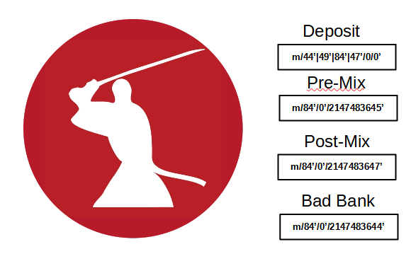
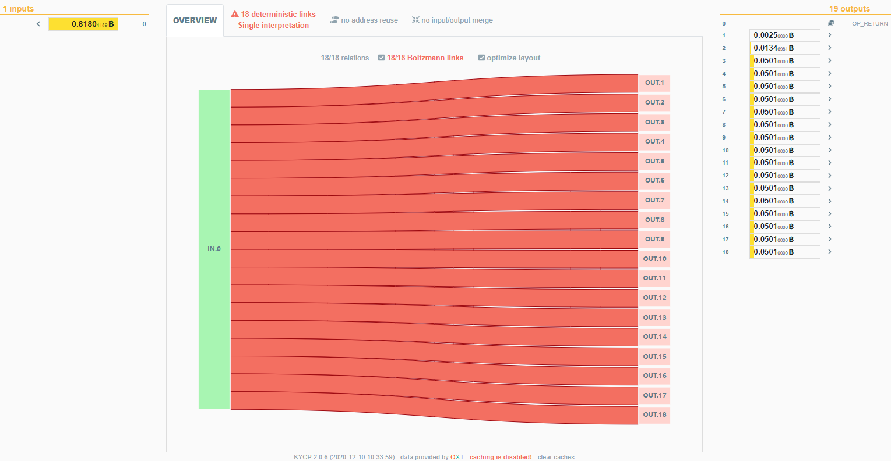
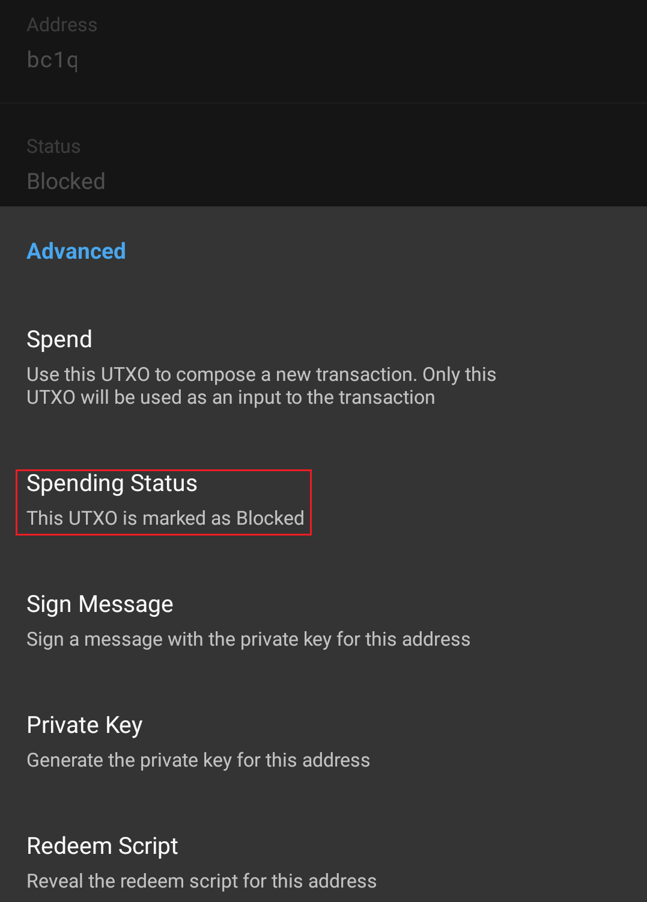
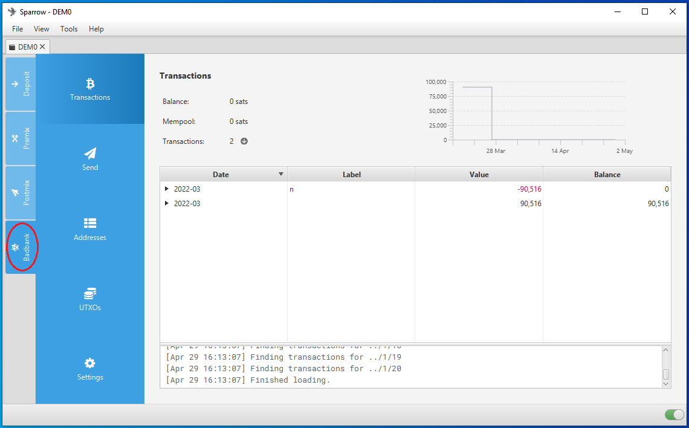
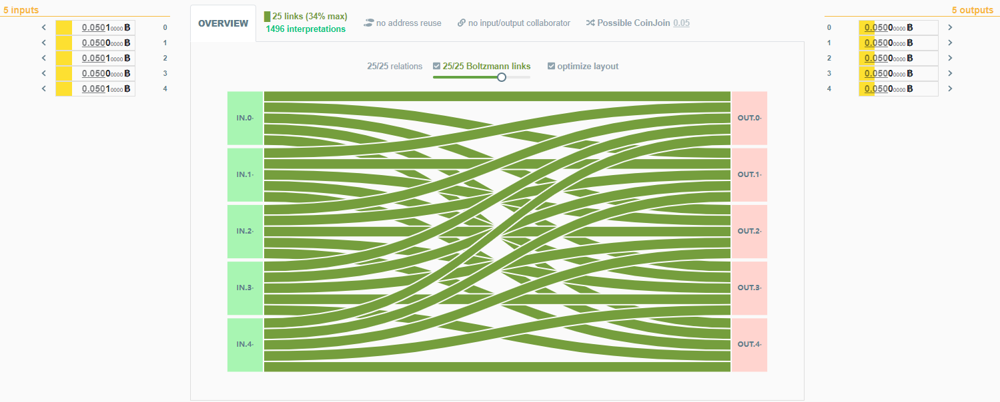
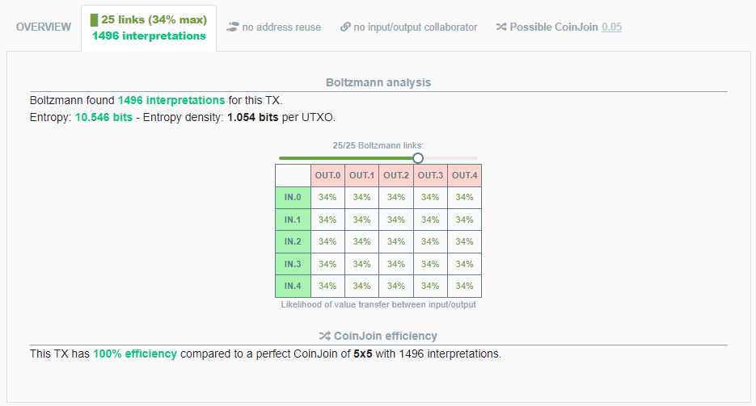

# Whirlpool & Post-Mix Spending
This section will explore some basic concepts related to the wallet structure around Whirlpool and demonstrate the post-mix spending tools built into [Samourai Wallet](https://samouraiwallet.com/) and [Sparrow Wallet](https://www.sparrowwallet.com/). Considerations should be made when spending Whirlpool Unspent Transaction Outputs (UTXOs) so that the anonymity benefits are kept intact. There are transaction tools that help you spend your post-mix bitcoin in a way that maintains anonymity, each tool offers different techniques and it's important to understand the differences so that you can always use the right tool for the job.

## Basic Wallet Structure
In both Samourai Wallet and Sparrow Wallet, the Whirlpool implementation is such that there is a four wallet structure used. These four wallets are all managed by your wallet software in the background, and from the user's perspective you can navigate between wallets seamlessly. Structuring the wallets in such a way is important so that your UTXOs remain sequestered from eachother, this way your UTXOs follow a logical path through the different stages along their way to the post-mix stage and arrive there with out any deterministic links to prior transaction history.  

Both Samourai Wallet and Sparrow Wallet have support for the following address formats:

- Pay to Public Key Hash (P2PKH), addresses that look like `17SkEw2md5avVNyYgj6RiXuQKNwkXaxFyQ` also referred to as "legacy". 
- Pay to Script Hash (P2SH), addresses that look like `3EEJFjZURxShNr2AoJtbfcvCB749yzP7LP` also referred to as "nested segwit".
- Pay to Witness Public Key Hash (P2WPKH), addresses that look like `bc1qqmmc3s46efrdq0jglhf8l8jg0xw37exgne6q3k` also referred to as "native segwit" or "Bech32".
- Pay to Taproot (P2TR), addresses that look like `bc1p0004nx9sh2qkvd7nzrkffx4xe5wacl8ya9yv5gtqkasatqrtgpaqrrcdg7` also referred to as "Taproot".
- Testnet Pay to Witness Public Key Hash (P2WPKH), addresses that look like `tb1qqakszcjex7zvjg7slarps5mpdngwlwsc5ll8v7` these are only for testing and retain no value.

Having support for all these address types does not mean that they all work with Whirlpool. Whirlpool only works with P2WPKH addresses on both Bitcoin Mainnet and Bitcoin Testnet. Therefore the four wallets described below all handle receiving P2WPKH addresses only and can spend to P2PKH, P2SH, P2WPKH, or P2TR addresses. 

The wallet software uses different derivation paths to achieve the separate wallets. The Deposit wallet can handle a variety of address types, hence the `m/44'`, `m/49'`, `m/84'`, `m/47'` for each of the BIP designations. 

  
  

  
- **Deposit Wallet**: this is the wallet you would make your deposits to. UTXOs in this wallet can be used to create inputs for Whirlpool CoinJoins through what is called a "Transaction Zero" (tx0). You can also just spend from this wallet like any other Bitcoin wallet. 
- **Pre-Mix Wallet**: this is where UTXOs go once they leave the deposit wallet through a tx0. UTXOs that reside here are registered as available inputs for Whirlpool CoinJoins. You do not want to deposit directly to this wallet or spend directly from this wallet, your software interface makes this very easy to manage. 
- **Post-Mix Wallet**: this is where your UTXOs go once they have been through a Whirlpool CoinJoin. These UTXOs can reside here for as long as you would like them to continue being randomly selected as free-riders to additional Whirlpool CoinJoins for free. 
- **Bad Bank Wallet**: this is where your toxic change goes from your tx0s. 

## Pools & tx0
There are 4 pool sizes in Whirlpool: 0.5, 0.05, 0.01, 0.001 BTC. This means that each Whirlpool CoinJoin output will be the same as the pool size. When you select UTXOs from your deposit wallet for Whirlpool CoinJoins, they go through a tx0 first. The results of this tx0 vary based on which pool size you select. For example, if you want to Whirlpool 10 bitcoin, the different pool sizes would produce these results through tx0:

### 0.5 Pool
- 10.00000000 BTC in.
- 1 x 0.01750000 BTC UTXO for the Whirlpool coordinator fee.
- 19 x 0.50001000 BTC UTXOs for Whirlpool inputs carrying a small extra amount for the miners fee. 1k sats miner fee was used in this example but this changes based on mempool congestion and desired urgency.
- 1 x 0.48231000 BTC UTXO as toxic change.

### 0.05 Pool
- 10.00000000 BTC in.
- 1 x 0.00175000 BTC UTXO for the Whirlpool coordinator fee.
- 199 x 0.05001000 BTC UTXOs for Whirlpool inputs carrying a small extra amount for the miners fee. Again, 1k sats used as an example here.
- 1 x 0.04626000 BTC UTXO as toxic change.

### 0.01 Pool
- 10.00000000 BTC in.
- 1 x 0.00050000 BTC UTXO for the Whirlpool coordinator fee.
- 998 x 0.01001000 BTC UTXOs for Whirlpool inputs carrying a small extra amount for the miners fee. Again, 1k sats used as an example here.
- 1 x 0.00952000 BTC UTXO as toxic change.

### 0.001 Pool
- 10.00000000 BTC in.
- 1 x 0.00005000 BTC UTXO for the Whirlpool coordinator fee.
- 9,900 x 0.00101000 BTC UTXOs for Whirlpool inputs carrying a small extra amount for the miners fee. Again, 1k sats used as an example here.
- 1 x 0.00095000 BTC UTXO as toxic change. 

Note that the Whirlpool coordinator fee remains the same regardless of how much bitcoin you are mixing. If you mix 1 BTC or 100 BTC in the 0.5 pool, you will pay 0.0175 BTC for the coordinator fee either way. 

Also note that the miner fee included with each pre-mix UTXO can accumulate to a large amount in miner fees as the number of pre-mix UTXOs increases. In the 0.001 pool example above, the total in miner fees is 0.099 BTC. 

tx0 applies in both Samourai Wallet and Sparrow Wallet. A tx0 is always constructed in such a way that one or more inputs from your deposit wallet are divided into:

- Several like-sized outputs, these are the pre-mix UTXOs that will go into Whirlpol CoinJoins later.
- One output for the Whirlpool coordinator fee.
- One output for the remaining change, this is called "Toxic Change".

Here is an actual tx0 example, you can see that there was:

- 1 input of 0.81804189 BTC 
- 16 equal-sized outputs of 0.0501 BTC
- 1 Whirlpool coordinator fee output of 0.0025 BTC (current fee has been reduced to 0.00175 BTC)
- 1 toxic change output of 0.0136981 BTC

You can view this transaction [on KYCP.org](https://kycp.org/#/323df21f0b0756f98336437aa3d2fb87e02b59f1946b714a7b09df04d429dec2).

Each of the 16 equal sized outputs will be individually selected for inputs to down stream Whirlpool CoinJoins. These outputs reside in the "Pre-Mix" wallet as available inputs to Whirlpool CoinJoins. As new Whirlpool transactions are initiated, the coordinator will look for available inputs such as these. The Whirlpool coordinator enforces strict rules that ensure no two outputs from the same tx0 wind up in the same Whirlpool CoinJoin transaction. Each of these 16 outputs carries a small amount of extra bitcoin so that once they are selected as inputs, they can help cover the miners fee for the Whirlpool CoinJoin transaction. 

The coordinator will randomly switch between creating transactions that have either 2 fresh participant UTXOs and 3 re-mix UTXOs or 3 fresh participant UTXOs and 2 re-mix UTXOs. The fresh particpant UTXOs always cover the miner fee and the re-mix UTXOs always get to mix for free. This way, you only pay the Whirlpool coordinator fee once and then your UTXOs can remain in your "Post-Mix" wallet remixing for free for as long as you want to keep them there.

## Toxic Change
Special considerations should be given to toxic change from the tx0. By default, Samourai Wallet will prompt you to mark the toxic change UTXO as "unspendable" during the tx0 initiation. Marking this UTXO in such a way prevents your wallet from displaying it as an available UTXO and excludes it from your displayed balance. 

In Sparrow Wallet, the toxic change UTXO is automatically sent to your Bad Bank wallet after the tx0, but you can go to that wallet 

You can always navigate to the 3-dot menu in the upper right-hand corner of the Samourai Wallet application and select `Show unspent outputs`, scroll to the bottom of the list and you will see your toxic change listed under `DO Not Spend`. Select the UTXO of interested and then you can update the spending status to "Spedable" if you want to. Then it will be displayed as part of your Deposit wallet balance and spendable again.

In Sparrow Wallet, the toxic change is automatically sent to your bad bank wallet after the tx0. You can go to the Bad Bank wallet tab and spend that UTXO from there at anytime. 

The issue with toxic change is that on-chain, it is still linked with the tx0 it came from. This means that it is also linked to all the previous transaction history of all the inputs to that tx0. So if an external observer was tracking the movement of bitcoin belonging to a known entity, then they would know that this toxic change output belongs to that entity. Therefore, using on-chain heuristics, the external observer could reasonably concluded that any bitcoin combined with the toxic change in a future transaction also belongs to the known entity. 

Using that logic, combining a toxic change UTXO with a post-mix UTXO would undo the anonymity benefits gained in Whirlpool. However, because of the wallet structure, you would really need to go out of your way and do something weird to commingle a toxic change UTXO and a Whirlpool output. 

The "Waterfall Technique" is where you start with the largest pool size you can given the available UTXOs in your deposit wallet. Then you take that toxic change output and use it alone in the next largest pool size you can, then repeat this process until you are left with the smallest possible toxic change amount. 

Another technique that is currently in development with Samourai Wallet is doing an Atomic Swap with Monero. This would require you to have a separate Monero wallet like [Monerujo](https://www.monerujo.io/) because monero will not be implemented in Samourai Wallet. But basically you could construct the Bitcoin transaction that trustlessly swaps your bitcoin with a peer for their Monero to your Monero wallet and your toxic change goes to their Bitcoin wallet. Then at a later time you could swap back for bitcoin or you could spend that Monero, the options are wide open for you. 

## Whirlpool UTXOs
After moving from your deposit wallet to your pre-mix wallet through a tx0, your pre-mix UTXOs are ready to be included in Whirlpool CoinJoins. Your wallet and the Whirlpool coordinator automatically take care of this in the background after you initiate your tx0. Each output from a Whirlpool CoinJoin is 1 of 5 equal sized outputs. To an external observer looking at a block explorer, they have no way to make a determination with certainty that a particular output belongs to a particular input. All of the 5 outputs have an equal probability of belonging to any of the 5 inputs. This concept is best illustrated with [KYCP.org](https://kycp.org/#/323df21f0b0756f98336437aa3d2fb87e02b59f1946b714a7b09df04d429dec2). 

Here is another way to look at the same Whirlpool CoinJoin transaction, as a table listing the liklihood of value transfer between input and output.

  

  

Because all the outputs are the same size and have the same liklihood of belonging to any given input, there is no distinguishing characteristic about them. This is anonymity, the quality or state of being indistinguishable from a crowd. Once this anonymity is achieved, you want to ensure you preserve it so that you can continue spending bitcoin on a public blockchain without revealing details that would reveal prior on-chain transaction history that exposes further details about you as an entity. To learn more about anonymity sets in relation to Whirlpool CoinJoins, read [this article](https://medium.com/samourai-wallet/diving-head-first-into-whirlpool-anonymity-sets-4156a54b0bc7). 

## BIP47 & PayNyms

## Post-Mix Spending Tools - Richochet

## Post-Mix Spending Tools - Stowaway

## Post-Mix Spending Tools - Stonewall

## Post-Mix Spending Tools - StonewallX2
