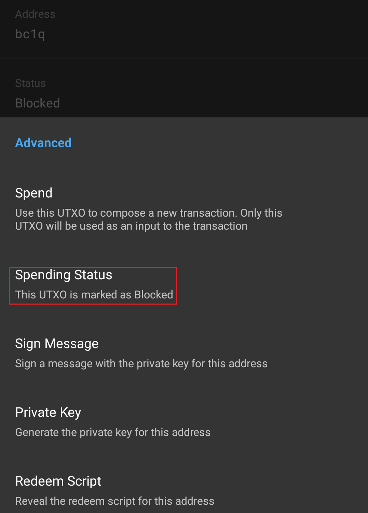
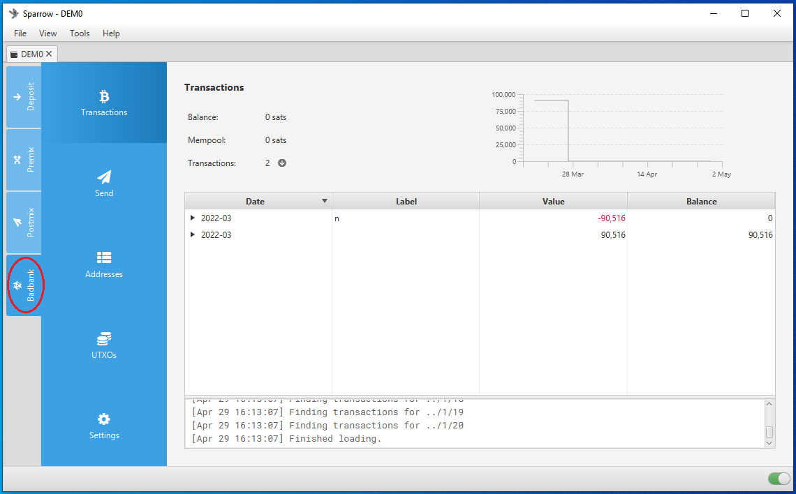
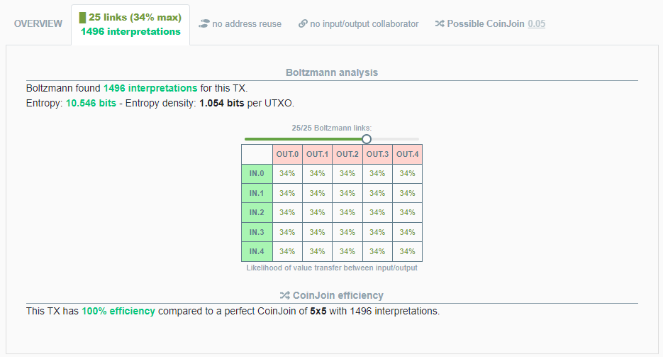
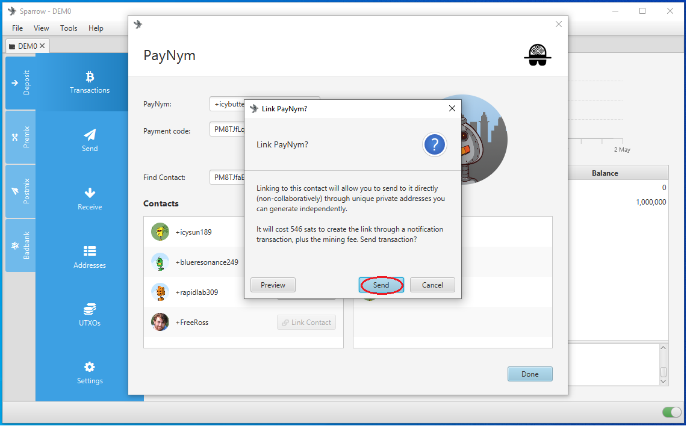

# Whirlpool & Post-Mix Spending
This section will explore some basic concepts related to the wallet structure around Whirlpool and demonstrate the post-mix spending tools built into [Samourai Wallet](https://samouraiwallet.com/) and [Sparrow Wallet](https://www.sparrowwallet.com/). Considerations should be made when spending Whirlpool Unspent Transaction Outputs (UTXOs) so that the anonymity benefits are kept intact. There are transaction tools that help you spend your post-mix bitcoin in a way that maintains anonymity, each tool offers different techniques and it's important to understand the differences so that you can always use the right tool for the job.

## Basic Wallet Structure
In both Samourai Wallet and Sparrow Wallet, the Whirlpool implementation is such that there is a four wallet structure used. These four wallets are all managed by your wallet software in the background, and from the user's perspective you can navigate between wallets seamlessly. Structuring the wallets in such a way is important so that your UTXOs remain sequestered from each other, this way your UTXOs follow a logical path through the different stages along their way to the post-mix stage and arrive there with out any deterministic links to prior transaction history.  

Both Samourai Wallet and Sparrow Wallet have support for the following address formats:

- Pay to Public Key Hash (P2PKH), addresses that look like `17SkEw2md5avVNyYgj6RiXuQKNwkXaxFyQ`, also referred to as "legacy". 
- Pay to Script Hash (P2SH), addresses that look like `3EEJFjZURxShNr2AoJtbfcvCB749yzP7LP`, also referred to as "nested segwit".
- Pay to Witness Public Key Hash (P2WPKH), addresses that look like `bc1qqmmc3s46efrdq0jglhf8l8jg0xw37exgne6q3k`, also referred to as "native segwit" or "Bech32".
- Pay to Taproot (P2TR), addresses that look like `bc1p0004nx9sh2qkvd7nzrkffx4xe5wacl8ya9yv5gtqkasatqrtgpaqrrcdg7`, also referred to as "Taproot". Samourai Wallet has support to spend to these addresses, Sparrow Wallet has support to spend to and receive from these addresses. 
- Testnet Pay to Witness Public Key Hash (P2WPKH), addresses that look like `tb1qqakszcjex7zvjg7slarps5mpdngwlwsc5ll8v7`, these are only for testing and retain no value.

Having support for all these address types does not mean that they all work with Whirlpool. Whirlpool only works with P2WPKH addresses on both Bitcoin Mainnet and Bitcoin Testnet. Therefore the four wallets described below all handle receiving P2WPKH addresses only and can spend to P2PKH, P2SH, P2WPKH, or P2TR addresses. 

The wallet software uses different derivation paths to achieve the separate wallets. Derivation paths use different numbers to represent different details about the key path: `m / purpose' / coin_type' / identity'`. In the example below, the Deposit wallet can handle a variety of address types, hence the `m/44'|m/49'|m/84'|m/47'` for each of the different purposes. The Pre-Mix, Post-Mix, & Bad Bank bank wallets only handle the `m/84'` purpose. 

 

  
- **Deposit Wallet**: this is the wallet you would make your deposits to. UTXOs in this wallet can be used to create inputs for Whirlpool CoinJoins through what is called a "Transaction Zero" (tx0). You can also just spend from this wallet like any other Bitcoin wallet. 
- **Pre-Mix Wallet**: this is where UTXOs go once they leave the deposit wallet through a tx0. UTXOs do not reside here for long, this is just a pass through where UTXOs are registered as available inputs for Whirlpool CoinJoins. You do not want to deposit directly to this wallet or spend directly from this wallet, your software interface makes this very easy to manage. 
- **Post-Mix Wallet**: this is where your UTXOs go once they have been through a Whirlpool CoinJoin. These UTXOs can reside here for as long as you would like them to continue being randomly selected as free-riders to additional Whirlpool CoinJoins for free. 
- **Bad Bank Wallet**: this is where your toxic change goes from your tx0s. 

In Samourai Wallet, you can toggle from your Deposit wallet to your Post-mix wallet by pressing the Samourai icon in the upper left-hand corner. 

 
 

In Sparrow Wallet, you can toggle between the four wallets using the tabs on the far left-hand side of the interface. 

## Pools & tx0
There are 4 pool sizes in Whirlpool: 0.5, 0.05, 0.01, 0.001 BTC. This means that each Whirlpool output will be the same as the pool size. When you select UTXOs from your deposit wallet for Whirlpool CoinJoins, they go through a tx0 first. The results of this tx0 vary based on which pool size you select. For example, if you want to Whirlpool 10 bitcoin, the different pool sizes would produce these results through tx0:

### 0.5 Pool
- 10.00000000 BTC in.
- 1 x 0.01750000 BTC UTXO for the Whirlpool coordinator fee.
- 19 x 0.50001000 BTC UTXOs for Whirlpool inputs carrying a small extra amount for the miners fee. 1k sats miner fee was used in this example but this changes based on mempool congestion and desired urgency.
- 1 x 0.48231000 BTC UTXO as toxic change.

### 0.05 Pool
- 10.00000000 BTC in.
- 1 x 0.00175000 BTC UTXO for the Whirlpool coordinator fee.
- 199 x 0.05001000 BTC UTXOs for Whirlpool inputs carrying a small extra amount for the miners fee. Again, 1k sats used as an example here.
- 1 x 0.04626000 BTC UTXO as toxic change.

### 0.01 Pool
- 10.00000000 BTC in.
- 1 x 0.00050000 BTC UTXO for the Whirlpool coordinator fee.
- 998 x 0.01001000 BTC UTXOs for Whirlpool inputs carrying a small extra amount for the miners fee. Again, 1k sats used as an example here.
- 1 x 0.00952000 BTC UTXO as toxic change.

### 0.001 Pool
- 10.00000000 BTC in.
- 1 x 0.00005000 BTC UTXO for the Whirlpool coordinator fee.
- 9,900 x 0.00101000 BTC UTXOs for Whirlpool inputs carrying a small extra amount for the miners fee. Again, 1k sats used as an example here.
- 1 x 0.00095000 BTC UTXO as toxic change. 

Note that the Whirlpool coordinator fee remains the same regardless of how much bitcoin you are mixing. If you mix 1 BTC or 100 BTC in the 0.5 pool as an example, you will pay 0.0175 BTC for the coordinator fee either way. 

Also note that the miner fee included with each pre-mix UTXO can accumulate to a large amount in miner fees as the number of pre-mix UTXOs increases. In the 0.001 pool example above, the total in miner fees is 0.099 BTC. 

tx0 applies in both Samourai Wallet and Sparrow Wallet. A tx0 is always constructed in such a way that one or more inputs from your deposit wallet are divided into:

- Several like-sized outputs, these are the pre-mix UTXOs that will go into Whirlpool CoinJoins later.
- One output for the Whirlpool coordinator fee.
- One output for the remaining change, this is called "Toxic Change".

Here is an actual tx0 example, you can see that there was:

- 1 input of 0.81804189 BTC 
- 16 equal-sized outputs of 0.0501 BTC
- 1 Whirlpool coordinator fee output of 0.0025 BTC (current fee has been reduced to 0.00175 BTC)
- 1 toxic change output of 0.0136981 BTC

You can view this transaction [on KYCP.org](https://kycp.org/#/323df21f0b0756f98336437aa3d2fb87e02b59f1946b714a7b09df04d429dec2).

Each of the 16 equal sized outputs will be individually selected for inputs to down stream Whirlpool CoinJoins. These outputs reside in the Pre-Mix wallet temporarily as available inputs to Whirlpool CoinJoins. As new Whirlpool transactions are initiated, the coordinator will look for available inputs such as these. The Whirlpool coordinator enforces strict rules that ensure no two outputs from the same tx0 wind up in the same Whirlpool CoinJoin transaction. Each of these 16 outputs carries a small amount of extra bitcoin so that once they are selected as inputs, they can help cover the miners fee for the Whirlpool CoinJoin transaction. 

The coordinator will randomly switch between creating transactions that have either 2 fresh participant UTXOs and 3 re-mix UTXOs or 3 fresh participant UTXOs and 2 re-mix UTXOs. The fresh participant UTXOs always cover the miner fee and the "free-rider" UTXOs always get to re-mix for free. This way, you only pay the Whirlpool coordinator fee once and then your UTXOs can remain in your Post-Mix wallet remixing for free for as long as you want to keep them there.

## Toxic Change
Special considerations should be given to toxic change from the tx0. By default, Samourai Wallet will prompt you to mark the toxic change UTXO as "unspendable" during the tx0 initiation. Marking this UTXO in such a way prevents your wallet from displaying it as an available UTXO and excludes it from your displayed balance. 

You can always navigate to the 3-dot menu in the upper right-hand corner of the Samourai Wallet application and select `Show unspent outputs`, scroll to the bottom of the list and you will see your toxic change listed under `DO Not Spend`. Select the UTXO of interest and then you can update the spending status to "Spendable" if you want to. Then it will be displayed as part of your Deposit wallet balance and spendable again.

In Sparrow Wallet, the toxic change is automatically sent to your bad bank wallet after the tx0. You can go to the Bad Bank wallet tab and spend that UTXO from there at anytime. 

The issue with toxic change is that on-chain, it is still linked with the tx0 it came from. This means that it is also linked to all the previous transaction history of all the inputs to that tx0. So if an external observer was tracking the movement of bitcoin belonging to a known entity, then they would know that this toxic change
 output belongs to that entity. Therefore, using on-chain heuristics, the external observer could reasonably assume that any bitcoin combined with the toxic change in a future transaction also belongs to the known entity. 

Using that logic, combining a toxic change UTXO with a Post-Mix UTXO would undo the anonymity benefits gained in Whirlpool. However, because of the wallet structure, you would really need to go out of your way and do something weird to commingle a toxic change UTXO and a Whirlpool output. 

The "Waterfall Technique" is where you start with the largest pool size you can given your available UTXOs in the Deposit wallet. Then you take that toxic change output and use it alone in the next largest pool size you can, then repeat this process until you are left with the smallest possible toxic change amount. 

Another technique that is currently in development with Samourai Wallet is doing an Atomic Swap with Monero. This would require you to have a separate Monero wallet like [Monerujo](https://www.monerujo.io/) because monero will not be implemented in Samourai Wallet. But basically you could construct the Bitcoin transaction that trustlessly swaps your bitcoin with a peer for their Monero to your Monero wallet and your toxic change goes to their Bitcoin wallet. Then at a later time you could swap back for bitcoin or you could spend that Monero, the options are wide open for you. 

## Whirlpool UTXOs
After moving from your deposit wallet to your pre-mix wallet through a tx0, your pre-mix UTXOs are ready to be included in Whirlpool CoinJoins. Your wallet and the Whirlpool coordinator automatically take care of this in the background after you initiate your tx0. Each output from a Whirlpool CoinJoin is 1 of 5 equal sized outputs. To an external observer looking at a block explorer, they have no way to make a determination with certainty that a particular output belongs to a particular input. All of the 5 outputs have an equal probability of belonging to any of the 5 inputs. This concept is illustrated well with [KYCP.org](https://kycp.org/#/323df21f0b0756f98336437aa3d2fb87e02b59f1946b714a7b09df04d429dec2). 

Here is another way to look at the same Whirlpool CoinJoin transaction, as a table listing the liklihood of value transfer between input and output.

  

  

Because all the outputs are the same size and have the same likelihood of belonging to any given input, there is no distinguishing characteristic about them. This is anonymity, the quality or state of being indistinguishable from a crowd. Once this anonymity is achieved, you want to ensure you preserve it so that you can continue spending bitcoin on a public blockchain without revealing details that would reveal prior on-chain transaction history that exposes further details about you as an entity. To learn more about anonymity sets in relation to Whirlpool CoinJoins, read [this article](https://medium.com/samourai-wallet/diving-head-first-into-whirlpool-anonymity-sets-4156a54b0bc7). 

## BIP47 & PayNyms
[BIP47](https://github.com/bitcoin/bips/blob/master/bip-0047.mediawiki) enables reusable payment codes that can be displayed like a static Bitcoin address on a website or a shop window for example. The advantage with the payment code is that external observers cannot see any transaction history or balances from the payment code like they can with a Bitcoin address. 

At a high-level, details are combined from the payment codes belonging to both transaction participants, resulting in an index of addresses that is only known to the two participants. This way, anyone who approaches a publicly displayed payment code and connects to it with the on-chain notification transaction will be able to send payments to the resulting addresses that are unique to that particular connection. There is no need for an active server to deliver a fresh address each time, as is the case with a payment server like [BTCPayserver](https://btcpayserver.org/). 

This is an example of a BIP47 payment code:

`PM8TJK7rnkDXabzmo4ZyxX49JxdLWhbFANDr4eBCwk1shDEs1qDysW5hFCFr6hschwJe4ny7C7GcSnsNPzBYvE6giabxfJyNSrAWRJYCoHMo7iveHned`

This can also be displayed as a QR code:

 

PayNyms on the other hand, are an implementation of BIP47 used in Samourai Wallet and Sparrow Wallet. PayNyms are derived from hashing your payment code to generate a unique robot avatar and a unique name. The avatar and name make it easier for humans to interpret and handle. Samourai Wallet maintains a directory of PayNyms if you want to explore, search, and connect with others: [https://paynym.is/](https://paynym.is/).

 

PayNyms can be used in a couple of different ways. You can use them to make direct payments to someone else's PayNym by making the on-chain connection and generating the index of secret addresses. There is no need for collaboration from the receiver; you can just scan their payment code, make the on-chain connection, and start sending payments to them. 

The other way to use PayNyms is through collaborative transactions like Stowaway and StonewallX2 which will be covered in later sections. 

### Samourai Wallet 
First, making the on-chain connection will be demonstrated: 

- Find the payment code you are interested in, [paynym.is](https://paynym.is/) was used in this example. 
- In Samourai Wallet, press the `blue "+" sign` then the `PayNym icon`.
- Once on the PayNym screen, press the `blue "+" sign` again.
- Press `SCAN QR CODE`, alternatively you can paste a copied payment code if you have it on your clipboard.
- Scan the QR code for the payment code you want to establish a connection with. 

- The PayNym details will populate on your screen, press `FOLLOW`.
- Confirm that you want to follow this PayNym. 
- Once followed, then you can connect, press `CONNECT`.
- A dialog will appear telling you the total amount for the connection, 15k sats + miners fee. Press `OK, FOLLOW`.
- The PayNym contact status will change to display both `Following` & `Connected`, you will also see the pending confirmations. 

Once your on-chain connection has been confirmed, you can navigate back to your PayNym and press the paper airplane icon to initiate a payment to your contact from your deposit wallet. Simply enter the amount, review transaction, and broadcast.

Alternatively, you can spend from your Post-Mix wallet directly to your PayNym contact. 

- Navigate to your Post-Mix wallet, press the `blue "+" sign` and select `Send`.
- Press the avatar icon in the upper right-hand corner. 
- Select your contact from the list that pops up. 
- Enter your amount, review transaction, and broadcast.

### Sparrow Wallet
Sparrow Wallet also has all the same features as just described with sending direct PayNym payments with Samourai Wallet. The layout of the interface is just a little different. 

- In Sparrow Wallet, navigate to `Tools` > `Show PayNym`.
- Copy a payment code and paste it in the `Find Contact` dialog box. 
- Then click on `Add Contact`.

 
 

- Once the PayNym is added, you will have the option to make the on-chain connection by clicking `Link Contact`.
- A dialog box will appear informing you that this notification transaction will cost 546 sats. Click `Send` to initiate.

 
 

- You can send directly from your deposit wallet by navigating to the `Deposit` tab and then the `Send` tab. 
- Click on the drop-down menu from the `Pay To` dialog box and select `PayNym or Payment Code`.
- Select your connected PayNym contact then click on `Send Directly`. 

 
 

- Enter a label. 
- Enter an amount.
- Follow the prompts to create, sign, and broadcast your transaction. 
- All of those steps can be followed from the Post-Mix wallet to spend from there as well. 

 
 

## Collaborative Post-Mix Spending Tools - Stowaway
Stowaway is a collaborative Post-Mix spending tool that obfuscates the amount being spent. The person you collaborate with will be the one receiving the spend. You provide some inputs, the receiver provides some inputs, you receive your change output, the receiver gets their change plus the amount you sent them thus the actual amount spent is hidden in that total. 

- The above image illustrates a Stowaway transaction on-chain. 
- You can see that the three inputs were 0.01, 0.00993439, & 0.01644414 for total of 0.03637853 input.
- The two outputs where 0.00484087 and 0.03144414 (and 0.00009352 for a miners fee)
- The spender sent 0.015 to the receiver in this transaction, but that amount does not match any inputs or outputs as it is obfuscated. 
- The receiver collaborated by providing the 0.01644414 input and received this amount back plus the 0.015 payment for the total 0.03144414 output.
- The 0.00484087 output was the spender's change.

An external observer would have no way of knowing this transaction is anything different than what is presented at face value. The common input ownership heuristics are broken because of the multiple inputs and outputs, the consideration must be made that multiple people contributed to the inputs. 

Anyone you are sending a Stowaway transaction to will need to be using Samourai Wallet or Sparrow
 Wallet with their PayNym. At a minimum the PayNyms should be following each other but it is not necessary to make the on-chain notification transaction to "connect" the PayNyms. 

Collaborators will need to have a way of communicating with each other out of band, like with a messaging app, phone call, etc.

### Samourai Wallet
To create a collaborative Stowaway transaction in Samourai Wallet, make sure you and your collaborator are following each other's PayNyms, it is not necessary to make the on-chain connection though. 

- navigate to your Post-Mix wallet.
- Select the `blue "+" sign` then `Send`.
- Toggle on `Cahoots`.
- Select `Stowaway`.
- Select `Online`. 

- Select your collaborator from your contact list.
- Enter the amount you would like to send. Select `Review Transaction` when finished. 
- Set your miner fee amount.
- Contact your collaborating peer and let them know to listen for your transaction from their wallet.
- Select `Begin Stowaway`.

- Details of the transaction will be communicated between peers encrypted over Tor on the Soroban communication layer. 
- You will see the progress of the transaction build progress through 5 steps in less than 10 seconds. 
- Once finished, review the details and select `Send`.
- A pop up dialog will ask you if you are sure you want to broadcast this transaction, select yes. 

The collaborating peer will receive their input to the transaction back with the amount you sent them added to the new output. The actual amount sent is obfuscated. 

### Sparrow Wallet
To create a collaborative Stowaway transaction in Sparrow Wallet, make sure you and your collaborator are following each other's PayNyms, it is not necessary to make the on-chain connection though. 

- Navigate to your `Postmix` wallet tab, then the `Send` tab.
- Select the drop-down option on the right-hand side of the `Pay to` field. 
- Select `PayNym or Payment code`.

- In the pop-up window, scroll down your contact list to your collaborator's PayNym and click on it.
- Then select the option to `Send Collaboratively`.

- Enter a label for your transaction, enter the amount to send, and set the miner fee rate.
- Then select the blue Mix Partner icon in the lower left-hand corner of the transaction graph.

- On the pop-up screen, you will see that your selected PayNym collaborator is already selected. 
- Select `Next` to initiate the transaction. 
- This is when you want to inform your collaborating partner that it is time for them to listen from their wallet. This is an out of band communication.

- Once your mix partner accepts the request, the transaction will be built.
- It takes some inputs from both parties returning the appropriate change to each.
- The receiver's change includes the amount you sent them.
- If everything looks good, select `Sign & Broadcast`.

- Once the transaction is broadcast, you will receive a confirmation. 

You can review this transaction on your favorite Bitcoin Testnet explorer, for example on [mempool.space](https://mempool.space/testnet/tx/80a917fb9a64977bb032bd707efbde39ae92aee00db98d0d4c4c9e60cbf78784)

The amount sent was 69 sats, but you would never know that as an external observer to this transaction. 

## Collaborative Post-Mix Spending Tools - StonewallX2
StonewallX2 is another collaborative spending tool that helps break on-chain heuristics and maintain anonymity. StonewallX2 transactions always have four outputs. The number of inputs can vary. At least two of those outputs are identical in size, this creates a decoy output the same size as the spend. The other two outputs are the change being returned to both collaborators. Unlike Stowaway transactions, StonewallX2 transactions can be spent to a third party - the spend does not have to be made to the collaborating partner.

Here is how a StonewallX2 (and a Stonewall) will look [on-chain](https://kycp.org/#/4c49b28a82c4f43b8facf8538ffaf05fa76cce46194ca07b9ca4916f9faeff0e):

### Samourai Wallet
To create a StonewallX2 transaction in Samourai Wallet, make sure you and your collaborator are following each other's PayNyms, it is not necessary to make the on-chain connection though. Also, if the receiver of this collaborative spend is a PayNym then you need to be following them as well. 

- Navigate to your Post-Mix wallet.
- Press the blue "+" sign and select `Send`.
- Paste or scan the receiving address, or if sending to a PayNym select them from your contact list by pressing the person icon.
- Select `STONEWALLX2`.

 
 - Select `Online`.
 - Select your collaborating peer from your contact list once it populates. 
 - Enter an amount to send.
 - Then press `REVIEW TRANSACTION`.

 
 - Set the miners fee rate. 
 - Double check the details.
 - Use your preferred out of band communication method to alert your collaborating peer to start listening for your request from their wallet.
 - Press `BEGIN STONEWALLX2`.
 - You will see the request being sent.
 - You will see the progress of the 5 steps.
 - Then you will have a chance to review the transaction before broadcasting, you will also receive a prompt asking you if you are sure you want to broadcast the transaction.

### Sparrow Wallet
To create a StonewallX2 transaction in Sparrow Wallet, make sure you and your collaborator are following each other's PayNyms, it is not necessary to make the on-chain connection though. Also, if the receiver of this collaborative spend is a PayNym then you need to be following them as well. 

- navigate to the `Postmix` tab then `Send`. 
- Enter the address you want to spend to.
- Add a label.
- Enter an amount. 
- Set the miners fee rate.
- Click on the blue coin stack in the lower left-hand corner of the transaction graph and you will notice that it changes to a person icon.

- In the pop-up window, select your collaborating peer from the drop-down list of contacts.
- Then select `Next` to initiate the StonewallX2 transaction. 
- This is when you will want to notify your collaborating peer to listen for your transaction request from their wallet, this is done with an out of band communication method of your choice.

You will wait a moment while your collaborating peer accepts the request and the transaction is built. Both peers are providing inputs to the transaction.

After a moment, you will be presented with a summary of the transaction that has been created. If everything looks good then select `Sign & Broadcast`.

Once the transaction is broadcast, you will receive a a green check mark. 

You can review this transaction on your favorite Bitcoin Testnet explorer, for example on [mempool.space](https://mempool.space/testnet/tx/d86ef43f016b8ed7d41f3a1520b6d641ee058eac53488fd33ad544213319536c)

The transaction has four outputs and two of them are the same size, one 25,000 sat spend and one 25,000 sat decoy. To an external observer they can not tell which outputs belong to the entity in control of any of the inputs.

## Non-Collaborative Post-Mix Spending Tools - Stonewall
Here is how a Stonewall (and a StonewallX2) will look [on-chain](https://kycp.org/#/f1592e0bec2af9e812d6ada0a46c267885d36358eab54f55098867a718828f53):
Stonewall is a non-collaborative spending tool that helps break on-chain heuristics and maintain anonymity. On-chain, Stonewall and StonewallX2 transactions are indistinguishable; they both always have four outputs. The number of inputs can vary. At least two of those outputs are identical in size, this creates a decoy output the same size as the spend. The other two outputs are the change being returned. In the case of a Stonewall transaction, the wallet will build the transaction using multiple inputs and four outputs, only one is the spend and the other three are all sent back to the sender's wallet with one of them being the same size as the spend. Both Samourai Wallet and Sparrow Wallet will attempt to compose a Stonewall transaction by default when spending.  

### Samourai Wallet
To make a Stonewall transaction with Samourai Wallet:

- Navigate to your Post-Mix wallet and press the blue "+" sign.
- Select `Send`.
- Paste or scan the address you want to spend to.

- Enter the amount to spend and press on `REVIEW TRANSACTION`.
- Set the miner fee rate.
- By default, Stonewall protection will be enabled if the wallet has the necessary UTXOs to create one. You will notice the entropy bits at the bottom, this can change if you slide the miner fee rate to different amounts. The wallet is trying different UTXOs for inputs as you do this.
- If everything looks good, press `SEND`.
- Confirm that you want to spend when prompted. 
- Then you will get the green confirmation screen that the transaction has been broadcast.

You can review this transaction on your favorite Bitcoin Testnet explorer, for example on [mempool.space](https://mempool.space/testnet/tx/5a951ba9898c5c3a74dad399d7121b286893fffb957093df0272d8a918d912ff)

The transaction has four outputs and two of them are the same size, one 42,000 sat spend and one 42,000 sat decoy. To an external observer they can not tell which outputs belong to the entity
 in control of any of the inputs. Three out of the four outputs are being returned to the sender's post-mix wallet.

### Sparrow Wallet
To make a Stonewall spend with Sparrow Wallet:

- Enter the address you wish to spend to.
- Add a label.
- Enter the amount to spend
- Set the miner fee rate

Notice the difference in how the transaction is constructed when selecting the `Efficiency` setting; there are two outputs, the spend and the change:

Contrast that with selecting the `Privacy` setting; this builds a Stonewall transaction where there are four outputs including a decoy spend:

- Click on `Create Transaction`.
- Then on the next screen, click on `Finalize Transaction for Signing`.

If everything looks good on the next screen, select `Sign`.

Once signed, you can broadcast the transaction.

You can review this transaction on your favorite Bitcoin Testnet explorer, for example on [mempool.space](https://mempool.space/testnet/tx/317c307730fa5c1a900b97dc6a7e2acce65c50d14dd9a645ece3c91e04a69d42)

The transaction has four outputs and two of them are the same size, one 690,000 sat spend and one 690,000 sat decoy. To an external observer they can not tell which outputs belong to the entity in control of any of the inputs.

## Post-Mix Spending Tools - Ricochet
Ricochet is a Post-Mix spending tool that creates multiple hops between the initial sending transaction and the final destination. This technique can be useful when sending bitcoin to a destination where the receiver will snoop back through your transaction history to determine if there is something about your UTXO they don't like. Often times this type of behavior is carried out by exchanges or some merchants; read [this](https://6102bitcoin.com/coinjoin-flagging/) article by 6102 for more details on CoinJoin flagging. There is no industry standard that these flagging companies adhere to, they will arbitrarily decide how many hops back is within their own risk tolerance. But the 5 hops that Ricochet provides seems to be doing the job. Sparrow Wallet does not support Ricochet transactions. Samourai Wallet collects a 100,000 sat fee for this service.

To compose a Ricochet transaction in Samourai Wallet:

- Navigate to your Post-Mix wallet and press the blue "+" sign.
- Then select `Send`.

 

- Toggle on the `Ricochet` option.
- Then toggle on the `Staggered delivery` option if you want each hop to be in a separate block.

Otherwise all 5 hops will occur in the same block, which may be preferable to you if time is of the essence. 

- Then paste or scan the address you would like to spend to. 
- Enter the amount to spend (the amount you want deposited to the final destination).
- Then press `REVIEW TRANSACTION`.

- Set the miner fee rate (the miner fee for all 5 hops is figured in).
- Review the transaction details.
- If everything looks good, press `SEND` and then confirm the spend to broadcast the transaction to the network.

 

[Here](https://mempool.space/testnet/address/tb1qcgr59653ppxzwhpqm4ly5yfea5rzle3vnky58e) is how this Ricochet transaction looks on Testnet. You can follow the hops along the way. 

